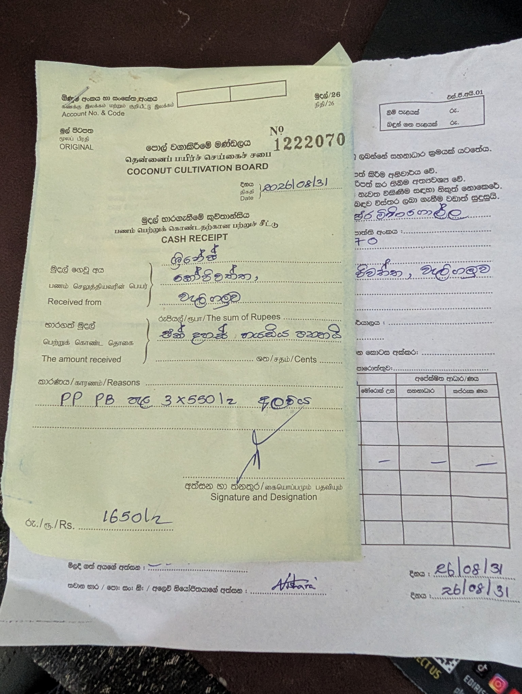
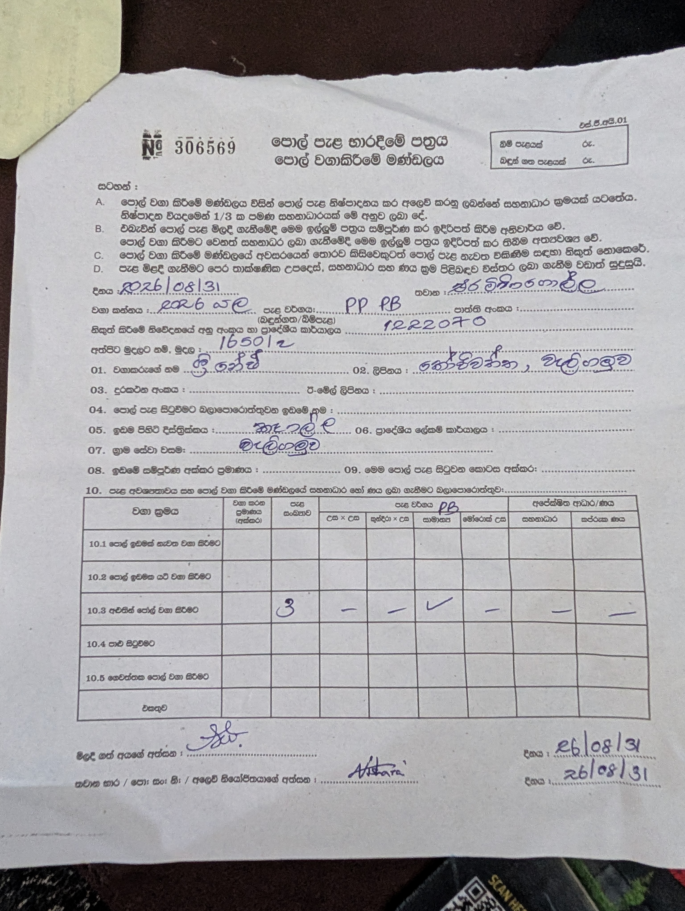

# Costs

All amounts in LKR. Add one row per purchase. Keep the receipt number when there is one.

## Purchases

| # | Date | Item | Details | Qty | Unit price | Total | Place | Receipt |
| --- | --- | --- | --- | --- | --- | --- | --- | --- |
| 1 | 2026-08-31 | Coconut seedlings | Type on the papers: `PP PB`, class `සාමාන්‍ය` (ordinary). Season 2026 Yala. | 3 | 550 | 1,650 | Coconut Cultivation Board, Eraminigolla | Cash receipt no. 1222070 |

**Total so far: 1,650**

## Cost by category

| Category | Total |
| --- | --- |
| Seedlings | 1,650 |
| Land / hole digging | 0 |
| Organic fertilizer | 0 |
| YPM / dolomite | 0 |
| Coconut husks | 0 |
| Water / irrigation | 0 |
| Tools | 0 |
| Transport | 0 |
| Labour | 0 |
| Other | 0 |
| **All** | **1,650** |

## Papers

### Cash receipt no. 1222070 — 2026-08-31

Reason line: `PP PB පැළ 3 x 550/= 1650/=`. Total Rs. 1650/=.

### Seedling handover form no. 306569 — 2026-08-31

`පොල් පැළ භාරදීමේ පත්‍රය` (coconut seedling handover form) of the Coconut Cultivation
Board.

| Field | Value |
| --- | --- |
| Place | Eraminigolla |
| Season | 2026 Yala |
| Seedling type | PP PB |
| Issue notice no. / regional office | 1222070 |
| Amount paid | 1650/= |
| Purpose (row 10.3) | `අළුතින් පොල් වගා කිරීමට` — new coconut planting |
| Number of seedlings | 3 |
| Class ticked | `සාමාන්‍ය` (ordinary), not a `උස x උස` or `කුරුඳා x උස` cross |

Rules printed on the form:

- The board sells seedlings under a subsidy. The subsidy is about 1/3 of the production
  cost.
- This form must be filled and handed over when buying seedlings, and also when asking
  for any other coconut planting subsidy.
- Seedlings must not be resold without permission from the board.
- Get the technical advice, subsidy and loan details **before** buying seedlings.

## Notes

- `PB` most likely means polybag — the same letters are printed above the seedling type
  table on the handover form. `PP` is still not confirmed. Ask the Eraminigolla office
  and write the answer here.
- Update **Total so far** and the category table every time a row is added.
