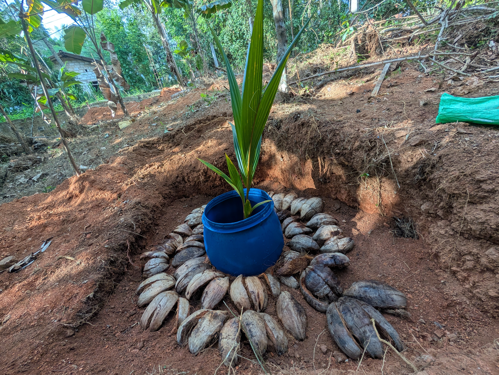
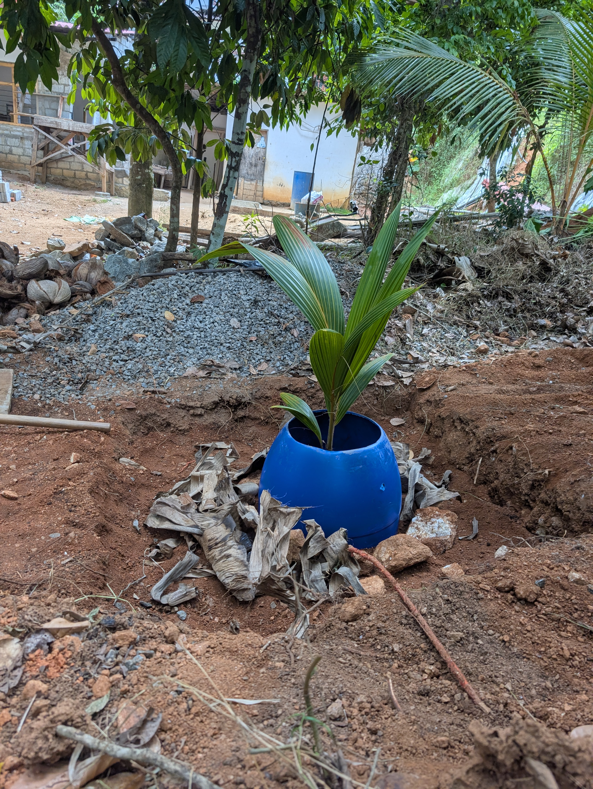

# Progress tracker

Each seedling gets an ID: `P01`, `P02`, `P03` ... Write the ID on a small tag or a
painted stone next to the plant, so the plant in the garden and the row in this table are
always the same plant. If plants are handled as one group (same day, same fertilizer),
still log each ID so a single sick plant can be followed later.

## Plants

| ID | Type | Bought on | From | Planted on | Place in the garden | Status |
| --- | --- | --- | --- | --- | --- | --- |
| P01 | PP PB (ordinary) | 2026-08-31 | Coconut Cultivation Board, Eraminigolla | 2026-09-08 | Closest to the main concrete road | planted |
| P02 | PP PB (ordinary) | 2026-08-31 | Coconut Cultivation Board, Eraminigolla | 2026-09-08 | Near mother's home, by the side of the road to mother's house | planted |
| P03 | PP PB (ordinary) | 2026-08-31 | Coconut Cultivation Board, Eraminigolla | not planted yet | - | in polybag |

Status values: `in polybag`, `planted`, `growing`, `sick`, `dead`.

## Event log

Newest entry at the bottom. One row per action, per plant or per group.

| Date | Plants | Action | Details |
| --- | --- | --- | --- |
| 2026-08-31 | P01, P02, P03 | Bought | 3 seedlings, 550 each, receipt no. 1222070. See [Costs](03%20Costs.md). |
| 2026-09-07 | P01, P02 | Hole dug | Excavator, 1.5 hours at 3,300/h. See [Costs](03%20Costs.md). |
| 2026-09-08 | P01, P02 | Planted | Planted in the prepared holes. See [Photos](#photos). |
| 2026-09-08 | P01 | Mulching | Ring of coconut husks around the plant. |
| 2026-09-08 | P02 | Mulching | Dry banana leaves around the plant. |

Action values: `Bought`, `Hole dug`, `Planted`, `Fertilizer`, `Watering`, `Mulching`,
`Pest / disease`, `Measured`, `Other`.

For a `Fertilizer` row, always write in Details: which fertilizer, how much per plant,
and how it was applied.

## Photos

### P01 — planted 2026-09-08

The seedling closest to the main concrete road, on the cut slope. Mulched with a ring of
coconut husks.

### P02 — planted 2026-09-08

The seedling near mother's home, by the side of the road to mother's house. Mulched with
dry banana leaves.

## Growth measurements

Measure every 3 months. It shows if a plant is doing badly before it looks bad.

| Date | Plant | Height (cm) | Number of leaves | Notes |
| --- | --- | --- | --- | --- |
| | | | | |

## Next actions

| Due | What | Plants | Done on |
| --- | --- | --- | --- |
| before planting | Dig the holes and fill them — see [Planting of coconut seedlings](02%20Planting%20of%20coconut%20seedlings.md) | P01, P02, P03 | 2026-09-07 for P01, P02 |
| as soon as possible | Plant the seedlings and add mulching | P01, P02, P03 | 2026-09-08 for P01, P02 |
| as soon as possible | Dig the hole, plant P03 and add mulching | P03 | |
| every few days until the plant settles | Water P01 and P02 | P01, P02 | |
| at planting | Ask the Coconut Development Officer for the fertilizer schedule for the first years, and write it in the section below | - | |

When an action is done, put the date in **Done on**, add a row to the **Event log**, and
add the next action here. If the status of a plant or the next step changed, update the
table in the [section landing page](index.md) too.

## Fertilizer plan

Not confirmed yet. Ask the Coconut Development Officer (see
[Contacts](01%20Contacts.md)) or the Eraminigolla office for the correct schedule for a
young palm, then fill this table.

| Age of plant | When | Fertilizer | Amount per plant |
| --- | --- | --- | --- |
| | | | |

Rule to follow: apply fertilizer when the soil is wet (with the rain), never on dry soil.
After each application, add a `Fertilizer` row to the **Event log** and put the next date
in **Next actions**.
