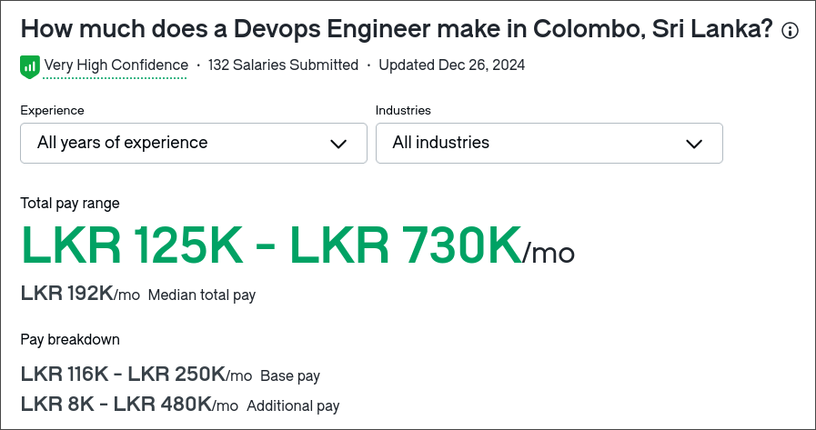

# Agenda

1. What is Continuous integration (CI)?
1. What is Continuous Delivery/Deployment (CD)?
1. Why CI/CD Matters
1. Key Components of CI/CD
1. Tools for CI/CD
1. Career Path
1. Q&A

---

# What is CI?

> Continuous integration is a DevOps software development practice where developers regularly merge their code changes into a central repository, after which automated builds and tests are run. Continuous integration most often refers to the build or integration stage of the software release process and entails both an automation component (e.g. a CI or build service) and a cultural component (e.g. learning to integrate frequently)

:::tip
The term `job` is used for a small unit of work while `pipeline` is a sequence of `jobs` in a specific order
:::

---

## Platforms for CI

- **GitHub Actions** - GitHub Actions is a product feature that lets you automate workflows with code
- **Jenkins** - Jenkins is an open source automation server
- **Azure DevOps** - Azure DevOps is a platform that supports software development with cloud or on-premises services
- **AWS CodePipeline** - AWS CodePipeline is a continuous delivery service that enables you to model, visualize, and automate the steps required to release your software.

---

## What do we do in CI jobs

- Secrets scanning
- Code formatting checks
- Code lint
- Dependency vulnerabilities
- Tests
- Build (build release artifacts)

---

## Examples

### Vercel lint pipeline

[source](https://github.com/vercel/vercel/blob/cc8c08e4688df1e76805614bf1c28b69e9f3f7a5/.github/workflows/test-lint.yml#L41-L52)

---

### nvim-java releases

[source](https://github.com/nvim-java/nvim-java/blob/e8e84413ca03e7d0541921e795b2e6bf8801f186/.github/workflows/release.yml?plain=1#L11-L18)

---

### Home Assistant vulnerability check

[source](https://github.com/home-assistant/core/blob/2e1463b9e9515a0a9413794a1efe7f66269a731e/.github/workflows/codeql.yml#L22-L34)

---

# What is CD

> Continuous delivery is a software development practice where code changes are automatically prepared for a release to production. A pillar of modern application development, continuous delivery expands upon continuous integration by deploying all code changes to a testing environment and/or a production environment after the build stage

- **Continuous Deployment/Delivery (CD):**
  - **Deployment:** Fully automated release of code to production.
  - **Delivery:** Automation up to a manual release checkpoint.

---

## Examples

### Supabase docker image release

[source](https://github.com/supabase/supabase/blob/2d1783ab00c0cd672828257f33155e717e252161/.github/workflows/publish_image.yml#L94-L103)

### My website deployment

[source](https://github.com/s1n7ax/my-website-ssr/blob/c69878402e6ad240d08165701cb2de98a3c0106b/.github/workflows/release.yml?plain=1#L23-L49)

---

# Why CI/CD Matters

- **Faster Development Cycles:** Code changes deployed rapidly.
- **Improved Collaboration:** Ensures consistent code quality across teams.
- **Early Bug Detection:** Tests catch issues before reaching production.
- **Reliability:** Automates repetitive tasks, reducing human error.
- **Scalability:** Efficient workflows that grow with the team.

---

# Key Components of CI/CD

- **Version Control Systems:** Git, GitHub, GitLab.
- **Build Automation:** Tools like Jenkins, GitHub Actions.
- **Testing Frameworks:** JUnit, Selenium, PyTest.
- **Deployment Automation:** Docker, Kubernetes, Terraform.
- **Monitoring Tools:** Prometheus, Grafana, Datadog.

---

# Popular CI/CD Tools

- **Jenkins**: Open-source CI tool with extensive plugin support.
- **GitHub Actions**: Native CI/CD for GitHub repositories.
- **GitLab CI/CD**: Integrated tool for GitLab repositories.
- **CircleCI**: Cloud-based CI/CD for fast pipeline setups.

---

# Best Practices

- Commit frequently to keep changes small and manageable
- Write clear and comprehensive tests
- Secure sensitive data with environment variables
- Monitor and analyze CI/CD pipelines for performance
- Regularly update and maintain the pipeline configuration

---

# Tips for Students

- Start with a simple CI/CD setup using GitHub Actions
- Explore Docker to containerize your applications
- Experiment with free-tier cloud services for deployment

---

# Career Path

| Role                      | ELI5 Explanation                                                  |
| ------------------------- | ----------------------------------------------------------------- |
| System Administrator      | Do more maintainance work and make sure applications is available |
| DevOps Engineer           | Build architecture to make the integration process effortless     |
| Site Reliability Engineer | Ensures the reliability, scalability, and performance             |

---

## Salaries

<!-- column_layout: [1, 1] -->

<!-- column: 0 -->

<!-- column: 1 -->

---

## DevOps

> DevOps is the combination of cultural philosophies, practices, and tools that increases an organization’s ability to deliver applications and services at high velocity

### Core Responsibilities

- Automation and CI/CD Pipelines (Jenkins, GitLab CI, GitHub Actions)
- Infrastructure Management (Terraform, Ansible, or CloudFormation)
- Monitoring and Logging (Prometheus, Grafana, Datadog, ELK Stack)
- Performance Optimization
- Incident Response

### Skills Required

- Technical Skills

  - Proficiency in Linux/Unix administration.
  - Knowledge of programming and scripting languages like Python, Bash.
  - Experience with version control systems, e.g., Git.

- Cloud Platforms

  - Experience with AWS, Azure, GCP, or other cloud providers.
  - Understanding of containerization using Docker and orchestration with Kubernetes

- Tooling Expertise

  - CI/CD tools (e.g., Jenkins).
  - Configuration management tools (e.g., Ansible, Puppet).
  - Monitoring tools (e.g., Nagios, Prometheus).

---

# Resources

---

# Q&A

- Open the floor for questions.
