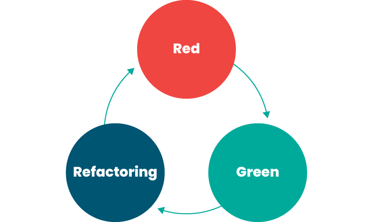

# Test Driven Development

By Srinesh Nisala

- [LinkedIn](https://www.linkedin.com/in/srinesh-nisala/)
- [Github](https://github.com/s1n7ax)

---

## 1. Introduction to Vitest

**Objective:** Get familiar with Vitest as the testing framework.

### Key Topics

- **What is Vitest?**
  - Fast unit testing framework built on top of Vite
  - Compatible with Jest's API
- **Core functions:**
  - `describe()` — groups related tests
  - `it()` — defines a single test case
  - `expect()` — asserts an expected value

```js
describe('password', () => {
  it('rejects short passwords', () => {
    expect(validatePassword('abc')).toEqual({ valid: false })
  })
})
```

- Write a simple passing test to confirm the setup works

---

## 2. Hands-On Demo: Password Validator

**Objective:** Build a password validator step by step using TDD.

### Pre-requisites

- Create a GitHub account
- Get a fork of [https://github.com/s1n7ax/lecture-tdd-v2](https://github.com/s1n7ax/lecture-tdd-v2)
- Open the project with Codespace

### Understanding the Project Structure

- Explain how to run tests

```shell
npm test
```

### Exercise

1. Create `password.js` and `password.test.js`
2. Write a test: short password returns `{ valid: false }`
3. Write a test: 8-char password returns `{ valid: true }`
4. Write a test: password with no uppercase returns `{ valid: false }`
5. Write a test: password with no digit returns `{ valid: false }`
6. Write a test: password with no special character returns `{ valid: false }`
7. Run all tests — show all RED
8. Implement minimum code: check `password.length >= 8`
9. Run tests — first two GREEN, rest still RED
10. Add the uppercase check (`/[A-Z]/`)
11. Run tests — show GREEN
12. Add the digit check (`/[0-9]/`)
13. Run tests — show GREEN
14. Add the special character check (`/[^a-zA-Z0-9]/`)
15. Run tests — all GREEN
16. Point out the smell: `{ valid: false, message }` repeated four times

---

## 3. Introduction to TDD

**Objective:** Understand the philosophy and purpose of TDD.

### Key Topics

- **What is TDD?**
  - Software development method where tests are written before the implementation
  - Ensures every piece of code has a clear purpose — to make a failing test pass
- **Red-Green-Refactor:**
  - **Red:** Write a failing test
  - **Green:** Write minimum code to make it pass
  - **Refactor:** Improve the code without changing behaviour



- **Pros:**
  - Tests act as living documentation — they show exactly what the code is supposed to do
  - Gives confidence to refactor without breaking existing behaviour
  - Forces you to think about the interface before the implementation
- **Cons:**
  - Hard to apply to UI, databases, and external APIs without extra tooling
  - Can give false confidence if tests only cover happy paths

### 4. References

- [TDD, Where Did It All Go Wrong](https://www.youtube.com/watch?v=EZ05e7EMOLM)
- [Jim Coplien and Bob Martin Debate TDD](https://www.youtube.com/watch?v=KtHQGs3zFAM)
