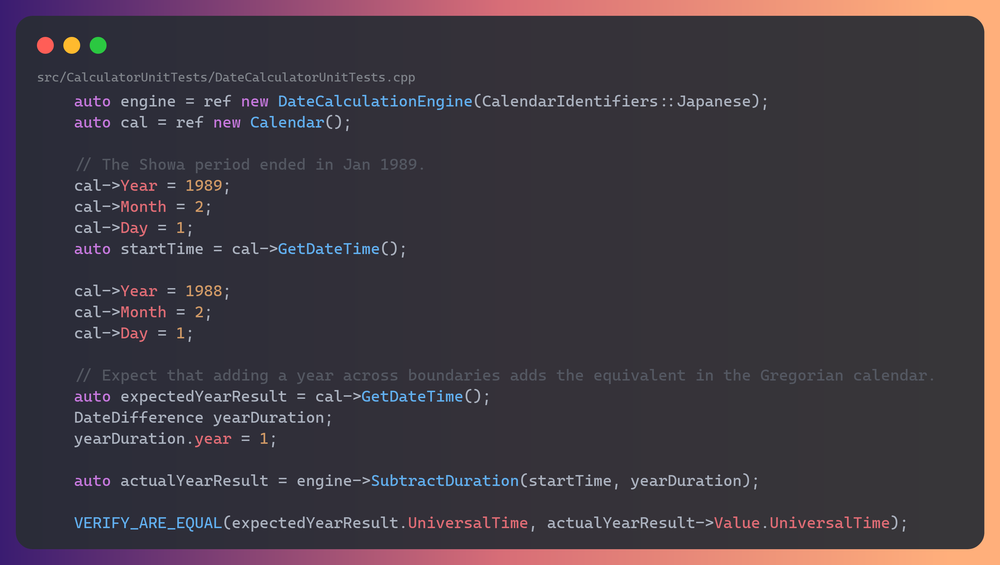
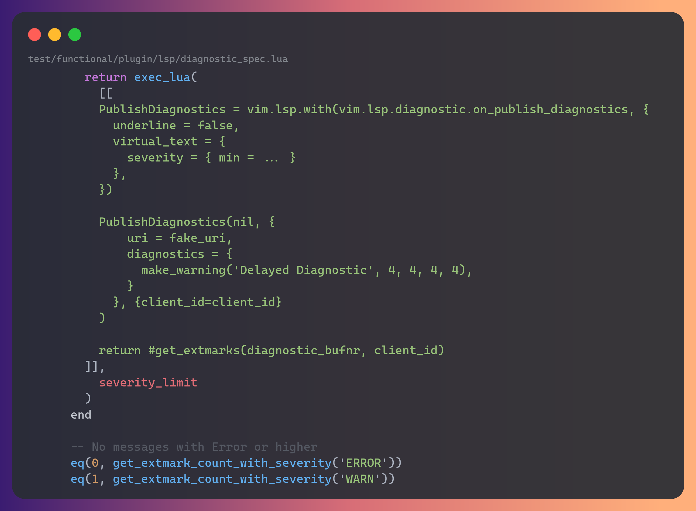
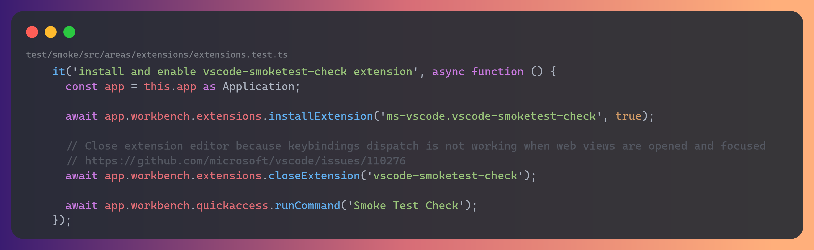
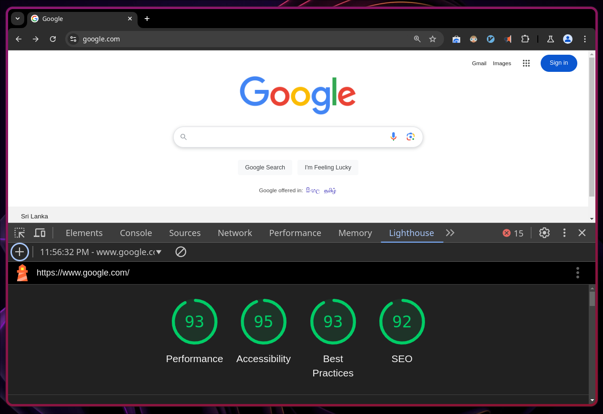
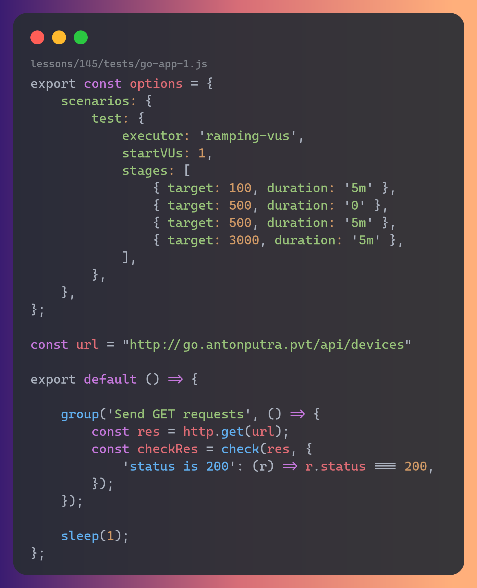
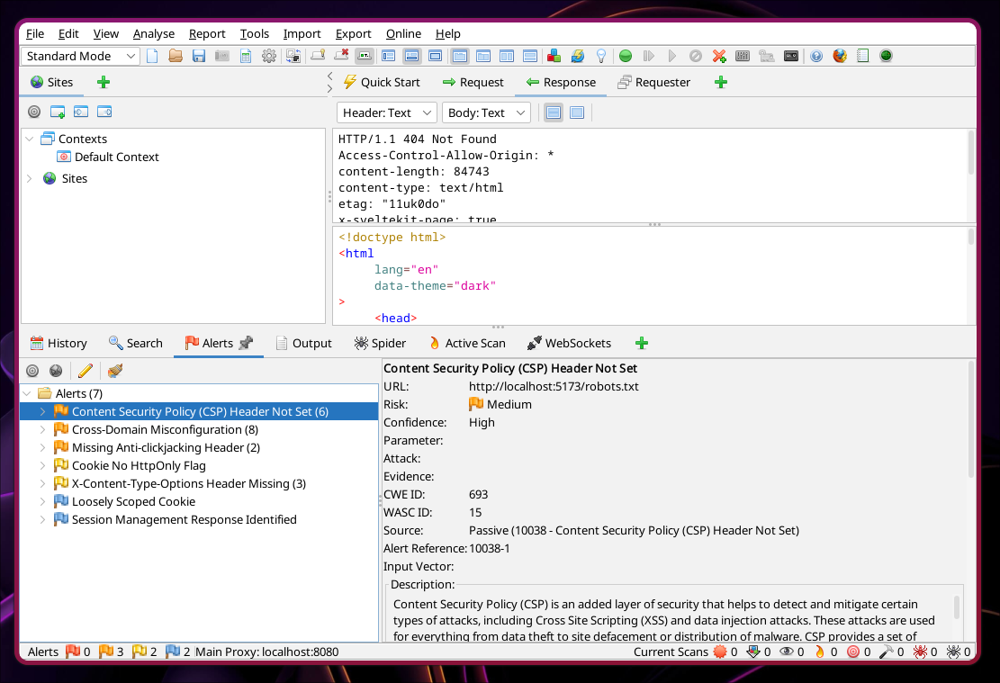
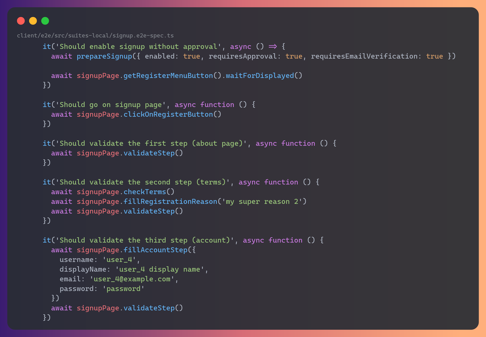
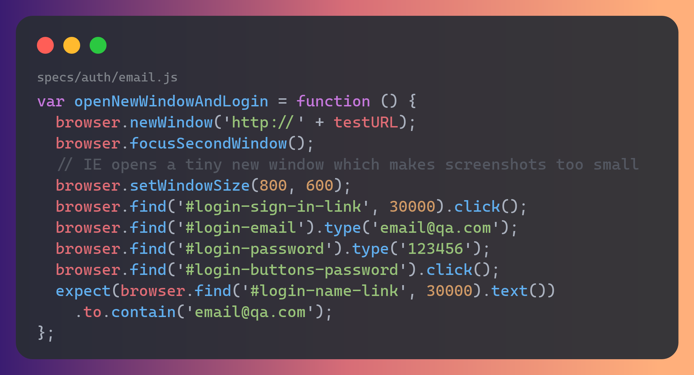
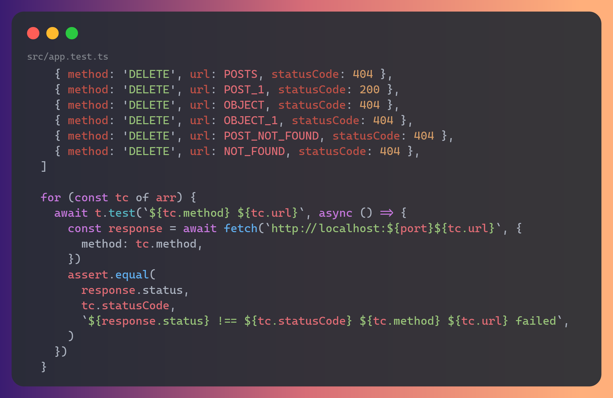
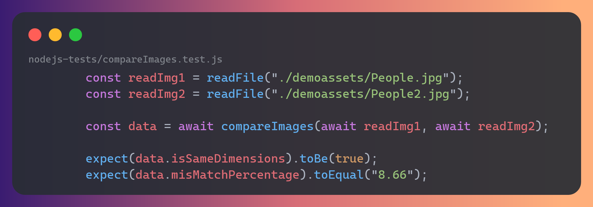

# Introduction to QA Automation

This lecture covers what automated testing is, the three **interfaces** we write tests through
(functions, API, UI), and the **types** of tests you'll hear about in industry.

Repo: **https://github.com/s1n7ax/lecture-intro-to-qa-automation-v2**

[old lecture notes](https://github.com/s1n7ax/lecture-intro-to-qa-automation)

---

## 0. Getting started

1. Open the repo above, then **`<> Code` → `Codespaces` → `Create codespace on main`**.
2. Wait ~1–2 minutes — the Codespace auto-runs `npm install && npx playwright install --with-deps chromium`.
3. Open a terminal (`` Ctrl+` ``) and run `npm run test:unit`. Green checkmarks mean you're ready.

---

## 1. What is test automation?

Testing checks that software does what it should. Instead of a human clicking through the app every
release, you **automate** it: write code that exercises the app and **asserts** the result, then run
it on demand in seconds.

Why automate?

- **Speed** (hundreds of checks in seconds),
- **regression safety** (catch what you broke today), and it
- **runs in CI** on every push.

A test is always the same shape:

```
INITIAL STATE   set up the inputs / open the page
ACT             call the function / click the button
ASSERT          check the result is what you expected
```

---

## 2. The three interfaces (hands-on)

### 2a. Functions — `Vitest`

Test a **pure function** directly, no browser or network. The code under test (`src/cart.js`):

```js
export function applyDiscount(amount, percent) {
  if (percent < 0 || percent > 100) {
    throw new Error(
      `Discount percent must be between 0 and 100, got ${percent}`,
    );
  }
  return amount - amount * (percent / 100);
}
```

The test (`tests/unit/cart.test.js`) — including the **error case**:

```js
import { describe, it, expect } from "vitest";
import { applyDiscount } from "../../src/cart.js";

it("takes the right amount off", () => {
  expect(applyDiscount(100, 20)).toBe(80);
});

it("rejects a discount above 100%", () => {
  expect(() => applyDiscount(100, 150)).toThrow();
});
```

> **🖥️ Demo:** `npm run test:unit`. Break `src/cart.js` (`-` → `+`) and rerun to see a test go red.

**Takeaway:** unit tests are fast and precise — they pinpoint the exact function that's wrong.

### 2b. API — `fetch` + `Vitest`

Skip the UI and test the **backend contract** over HTTP, against the public
**[Swagger Petstore](https://petstore.swagger.io/)**. APIs describe themselves with an
**OpenAPI/Swagger spec**, which also powers the **Swagger UI** ("Try it out").

```js
it("GET /pet/findByStatus returns a list of available pets (200)", async () => {
  const res = await fetch(
    "https://petstore.swagger.io/v2/pet/findByStatus?status=available",
  );
  expect(res.status).toBe(200);
  const pets = await res.json();
  expect(Array.isArray(pets)).toBe(true);
});
```

> **🖥️ Demo:** open **https://petstore.swagger.io/**, expand `GET /pet/findByStatus` →
> **Try it out → Execute**. Then `npm run test:api` hits the same endpoint in code.

**Takeaway:** API tests are fast and don't depend on the UI — ideal for business logic and contracts.

### 2c. UI — `Playwright`

Drive a **real browser** like a user, using **[Playwright](https://playwright.dev/)** against
**[the-internet.herokuapp.com](https://the-internet.herokuapp.com/login)**. Playwright **auto-waits**
for elements, which makes tests far less flaky.

```js
import { test, expect } from "@playwright/test";

test("valid login lands on the secure area", async ({ page }) => {
  await page.goto("/login");
  await page.fill("#username", "tomsmith");
  await page.fill("#password", "SuperSecretPassword!");
  await page.click('button[type="submit"]');

  await expect(page).toHaveURL(/.*secure/);
  await expect(page.locator("#flash")).toContainText(
    "You logged into a secure area!",
  );
});
```

> **🖥️ Demo:** `npm run test:ui`, then `npm run test:ui:report` for the trace and screenshots.

**Takeaway:** UI tests are the most realistic but slowest — use them for critical journeys, not everything.

---

## 3. Types of tests

These are the words you'll see in job ads and tickets — **what** you're testing and **why**, not the
tool. Many are automated through the same three interfaces above.

### Unit — _Developer_

One function or class in isolation.



_Source: [MS Calculator](https://github.com/microsoft/calculator/blob/09a39a500e5b3dd2778df58d8ddc61e652246a24/src/CalculatorUnitTests/DateCalculatorUnitTests.cpp?plain=1#L997-L1017)_

### Integration — _Developer_

Several units working together.



_Source: [Neovim](https://github.com/neovim/neovim/blob/dde2cc65fd2ac89ad88b19df08dc03cf1da50316/test/functional/plugin/lsp/diagnostic_spec.lua?plain=1#L127-L154)_

### Smoke — _QA_

"Does the build even launch?"



_Source: [VS Code](https://github.com/microsoft/vscode/blob/6fb1f6fbdd167ca4599f6ad28323257c3704a777/test/smoke/src/areas/extensions/extensions.test.ts?plain=1#L15-L25)_

### Performance — _QA_

Speed and responsiveness under normal use.



_Source: Chrome Lighthouse (google.com)_

### Load — _QA_

Behaviour under heavy/concurrent traffic.



_Source: [Anton Putra (YouTube)](https://github.com/antonputra/tutorials/blob/5098b4b9738a920a8a5708f7721faa843449855f/lessons/145/tests/go-app-1.js?plain=1#L4-L31)_

### Security — _Security / QA_

Vulnerabilities and misuse.



_Source: OWASP ZAP_

### End-to-End — _QA_

A whole user journey across the system.



_Source: [PeerTube](https://github.com/Chocobozzz/PeerTube/blob/0b145cfc9ac2eebd3ca922a7e38cf000e7e75348/client/e2e/src/suites-local/signup.e2e-spec.ts?plain=1#L322-L407)_

### UI — _QA_

The interface behaves and looks right.



_Source: [Meteor](https://github.com/meteor/e2e/blob/8e74741f46e14d8918399144fa22692002ebab02/specs/auth/email.js?plain=1#L15-L26)_

### API — _QA_

Endpoints honour their contract.



_Source: [json-server](https://github.com/typicode/json-server/blob/6aa56d9581488d9bcd1baf42c4c97b293cd9ee99/src/app.test.ts?plain=1#L109-L128)_

### Visual regression — _QA_

The UI didn't change pixels unexpectedly.



_Source: [Resemble.js](https://github.com/rsmbl/Resemble.js/blob/581c1bb757e3fdd7f151c47ad8ca6eafcce5019a/nodejs-tests/compareImages.test.js?plain=1#L9-L23)_

> **Functional**, **regression**, and **acceptance** testing describe **intent**, not a tool — any of
> the tests above can serve those goals depending on what you're checking.

---

## 4. 🙌 Your turn — practical (~5 min)

You've seen a **valid** login test. Now write one for an **invalid** login (**negative testing**).

1. Open **`tests/ui/practical.spec.js`** and follow the `// TODO` comments:
   - fill `#username` with `wronguser`, `#password` with `wrongpass`, click submit
   - assert `#flash` contains **`Your username is invalid!`**
2. Run `npm run test:ui`. Stuck? The answer is in `solutions/practical.solution.spec.js`.

**Bonus:** also assert the page is still on `/login` (the user was _not_ let in).

---

## 5. Recap

- A test is always **arrange → act → assert**.
- We automate through three **interfaces**, trading speed for realism:
  - **Functions** (Vitest) — instant, isolates logic.
  - **API** (fetch + Vitest) — fast, checks the backend contract.
  - **UI** (Playwright) — realistic, drives a real browser.
- Test **types** (unit, integration, smoke, performance, security, …) describe _what & why_.

### Go further

- Vitest — https://vitest.dev/
- Playwright — https://playwright.dev/
- Swagger / OpenAPI — https://swagger.io/
- Practice targets — https://the-internet.herokuapp.com/ · https://petstore.swagger.io/
