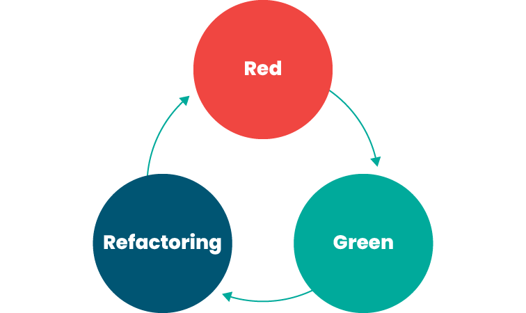

# Test Driven Development

by Srinesh Nisala (Senior Software Engineer @ iLabs)

- LinkedIn: [https://www.linkedin.com/in/srinesh-nisala/](https://www.linkedin.com/in/srinesh-nisala/)
- GitHub: [https://github.com/s1n7ax](https://github.com/s1n7ax)

---

## Pre-requisites

- Create a Github account
- Get a fork of [https://github.com/s1n7ax/lecture-tdd](https://github.com/s1n7ax/lecture-tdd)
- Open the project with Codespace

---

## Project structure

- Explain how to run the application using IDE & Gradle

```shell
# with gradle
gradle run

# with gradle wrapper
./gradlew run
```

- Explain how to run tests using IDE & Gradle

```shell
# with gradle
gradle test

# with gradle wrapper
./gradlew test
```

---

## Basics of JUnit

- Create a simple test to print hello world (check the output in the debug console tab)

- Introduce `beforeEach` and `afterEach` annotations

---

## Exercise 1

- Create a `Calculator` class and add `addition` method
- Show how to use IDE features to quickly create a test class
- Tryout the `addition` method manually
- Create a unit test to test the `addition` method

---

## Exercise 2

- Create a test case for `subtraction` method
- Use IDE features to generate the method signature
- Implement the `subtraction` method

---

## What is TDD?

> Test-Driven Development (TDD) is a Software development method in which you write Automation Tests before the actual development process starts



Red-Green-Refactor:

- Focus on testing behaviors (requirements) rather than implementation details.
- Write minimal code to pass tests ("green"),
- Refactor without adding new tests.

---

## TDD Best Practices

- Reduce mocking and stubbing
- Avoid testing private/internal code; focus on public interfaces
- Avoid Over-Testing

---

## More on TDD

- [TDD, Where Did It All Go Wrong](https://www.youtube.com/watch?v=EZ05e7EMOLM)
- [Jim Coplien and Bob Martin Debate TDD](https://www.youtube.com/watch?v=KtHQGs3zFAM)
