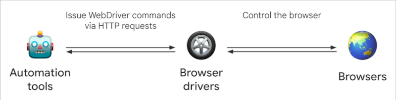
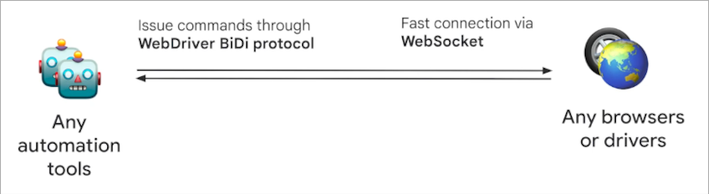

# Selenium

**tldr;** Instead of using mouse and keyboard to control browser, you call a Selenium function.

> Selenium is a software project that allows you to automate web applications using various browsers

---

## Components of Selenium

ELI5 description

- **Web Driver** - jar file with bunch of classes to automate browser
- **Selenium IDE** - records actions you perform on browser and creates an automation script
- **Selenium Grid** - Run tests remotely


---

## Selenium IDE hands on

> [!NOTE]
> Scripts created by this plugin is pretty terrible
> Not necessarily because it's bad engineering
> It's genuinely a hard problem

- Download and install the [Selenium IDE](https://www.selenium.dev/selenium-ide) (4MB)
- Create a new project
- Start a new recording with [https://demoqa.com/text-box](https://demoqa.com/text-box)
- Export the recorded script to a Java JUnit file

> [!NOTE]
> Generated code is using JUnit 4

---

## Selenium Web Driver hands on

### Pre-requisites

- Java 21
- Gradle 8
- Firefox
- VSCode with **Extension Pack for Java** (or any other Java IDE)

---

## Simple Selenium Demo

---

## Webdriver classic, WebDriver BiDi

```shell
Dec 21, 2024 9:12:29 AM org.openqa.selenium.firefox.FirefoxDriver <init>
WARNING: CDP support for Firefox is deprecated and will be removed in future versions. Please switch to WebDriver BiDi.
```

### WebDriver classic architecture



### WebDriver BiDi architecture



---

### Enable BiDi

#### Chrome

```java
var options = new ChromeOptions();
options.setCapability("webSocketUrl", true);
browser = new ChromeDriver(options);
```

#### Firefox

```java
var options = new FirefoxOptions();
options.setCapability("webSocketUrl", true);
browser = new FirefoxDriver(options);
```

---

## Remove extensions

> [!NOTE]
> While most Selenium commands are included in the specification, some things are browser specific

### On Chrome

```java
var options = new ChromeOptions();
options.addArguments("--disable-extensions");
browser = new ChromeDriver(options);
```

### On Firefox

```java
var options = new FirefoxOptions();
options.addArguments("--safe-mode");
browser = new FirefoxDriver(options);
```

> [!NOTE]
> --safe-mode flag in Firefox disables multiple features including extensions
> Such as Hardware Acceleration & Themes etc

---

---

## Common Exceptions

ELI5 description;

- `NoSuchElementException` - Element you are looking for is not in the webpage. If selector is correct, see if it's inside an iframe
- `StaleElementReferenceException` - Element was there but not right now
- `ElementClickInterceptedException` - Popup probably covering the element or not in the view

> [!TIP]
> Looking for info? Search in [documentation](https://www.selenium.dev/documentation) first
> Then try GPTing it or try Stackoverflow

---

## Page object model design pattern

### Why page object model

- Re-usability
- Ease of maintenance
- Better readability and clarity

---

- Create pages from form and form output

```java
public class Page {
  private WebDriver browser;

  @FindBy(id = "identifier")
  private WebElement elementName;

  Page(WebDriver browser) {
    this.browser = browser;
    PageFactory.initElements(browser, this);
  }

  public void doSomething(String value) {
    this.elementName.sendKeys(value);
  }
}
```

---

# Headless mode

[changes](https://github.com/s1n7ax/lecture-intro-to-qa-automation/compare/step-5...step-6)

### Chrome

```java
var options = new ChromeOptions();
options.addArguments("--headless=new");
browser = new ChromeDriver(options);
```

### Firefox

```java
var options = new FirefoxOptions();
options.addArguments("--headless");
browser = new FirefoxDriver(options);
```

---

# Questions?
