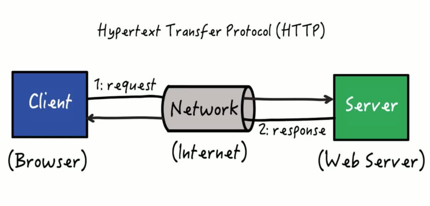

# API Testing

By Srinesh Nisala

- LinkedIn: [https://www.linkedin.com/in/srinesh-nisala/](https://www.linkedin.com/in/srinesh-nisala/)
- GitHub: [https://github.com/s1n7ax](https://github.com/s1n7ax)

---

## Pre-requisites

- [Bruno](https://www.usebruno.com/downloads)
  - [Why Bruno not Postman?](https://www.usebruno.com/compare/bruno-vs-postman)
- [xh](https://github.com/ducaale/xh/releases)
- [Github account](https://github.com/)

> [!NOTE] It's important to understand the basics of HTTP and RESTful than how
> to use a specific tool.

---

## Website vs Web Service

- **Website:** Deliver human-consumable content via a browser
  - Interaction is user-driven (clicks, scrolls, inputs)
  - Technologies: HTML, CSS, JavaScript
- **Web Service:** Enable machine-to-machine communication over the web
  - Data is transferred in structured formats (e.g., JSON/XML)
  - Technologies: REST, SOAP, GraphQL

---

## Exercise 1: HTTP Request and Response

- Open a new browser tab
- Open the network tab in the developer tools
- Visit a website (e.g., [https://www.google.com](https://www.google.com))
- Observe the first network requests made by the browser



---

## Exercise 2: Calling a web service using HTTP

- What is [json placeholder](https://jsonplaceholder.typicode.com/)?
- Open network tab in the developer tools
- Go to [https://jsonplaceholder.typicode.com/posts](https://jsonplaceholder.typicode.com/posts)
- Observe the
  - Response Data
  - Response Status Code (<kbd>ctrl</kbd> + <kbd>shift</kbd> + <kbd>r</kbd>` if you are getting 304)

---

## Exercise 3: Using other tools to call a web service

- Open network tab in the developer tools
- Go to [https://jsonplaceholder.typicode.com/posts/1](https://jsonplaceholder.typicode.com/posts/1)
- Observe the response data
- Use `xh` to make the same request `xh https://jsonplaceholder.typicode.com/posts/1`
- Use Bruno to make the same request
  - Create a new collection
  - Create a new request
  - Set the method to `GET`
  - Set the URL to `https://jsonplaceholder.typicode.com/posts/1`
  - Click on `Send`

---

## Exercise 4: Using Bruno to make a POST request

- Create a new request
- Set the method to `POST`
- Set the URL to `https://jsonplaceholder.typicode.com/posts`
- In the body tab, select `JSON` and enter the following JSON data:

  ```json
  {
    "title": "foo",
    "body": "bar",
    "userId": 1
  }
  ```

- Click on `Send`

---

## Exercise 5: Using REST Assured to make a GET/POST request

- Open

---

## HTTP vs RESTful

- HTTP (Hypertext Transfer Protocol, 1996): [source](https://www.rfc-editor.org/rfc/rfc9110.html#name-introduction)
  - Protocol for transferring data over the web
- RESTful (Representational State Transfer, 2000): [source](https://www.ics.uci.edu/~fielding/pubs/dissertation/rest_arch_style.htm)
  - An architectural style (not a protocol!) for designing networked applications
