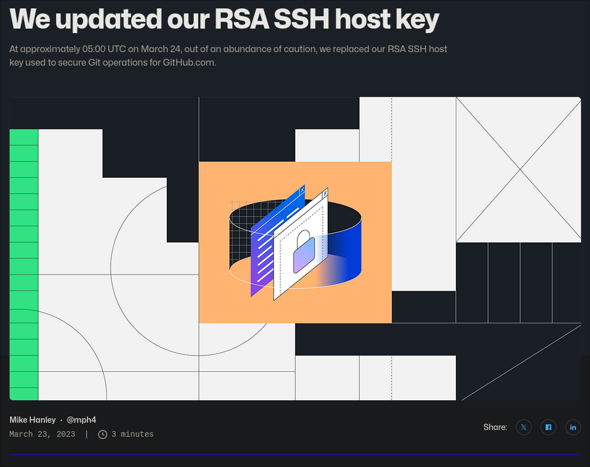
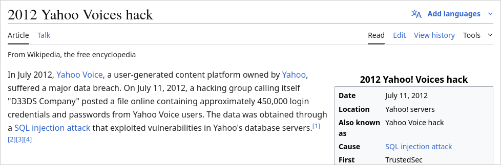
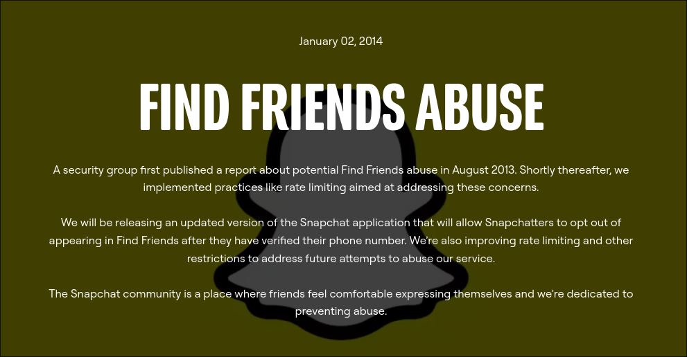
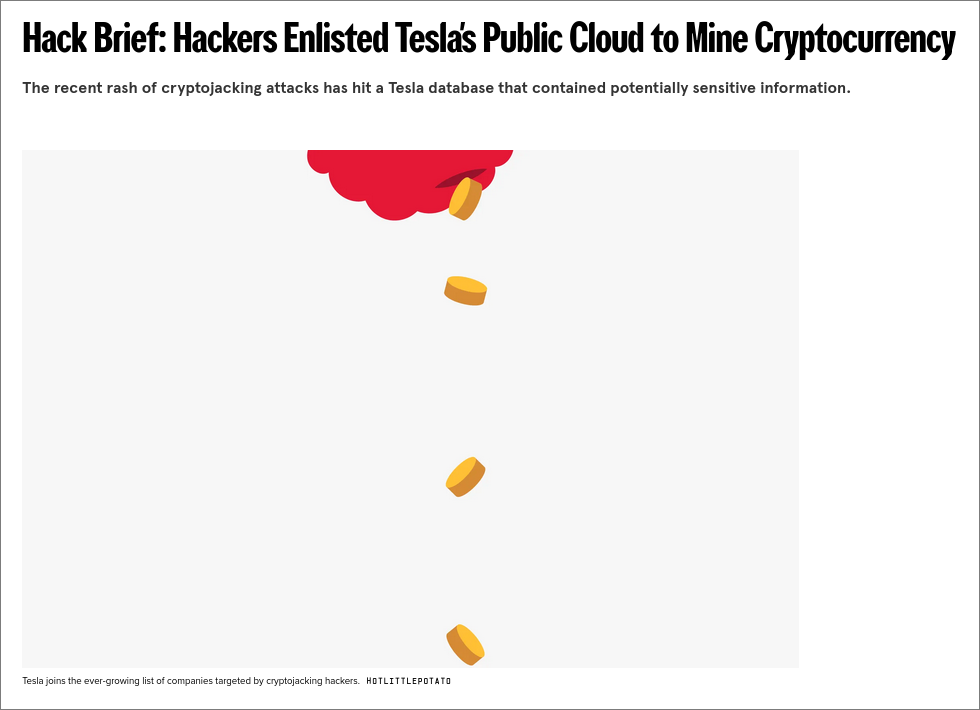
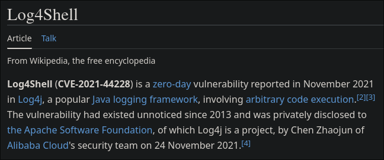
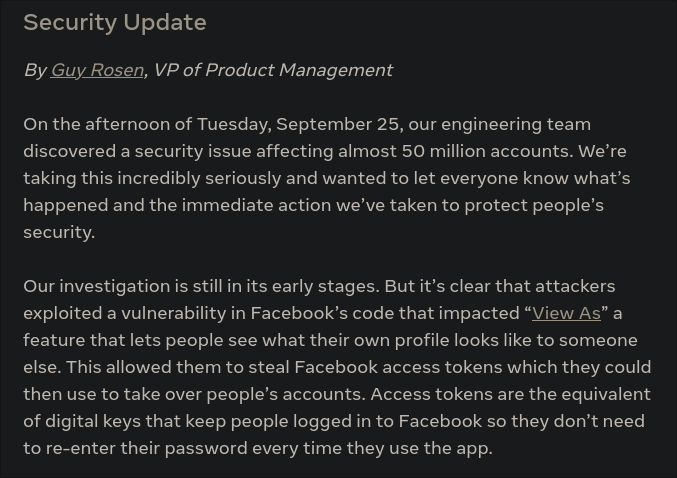
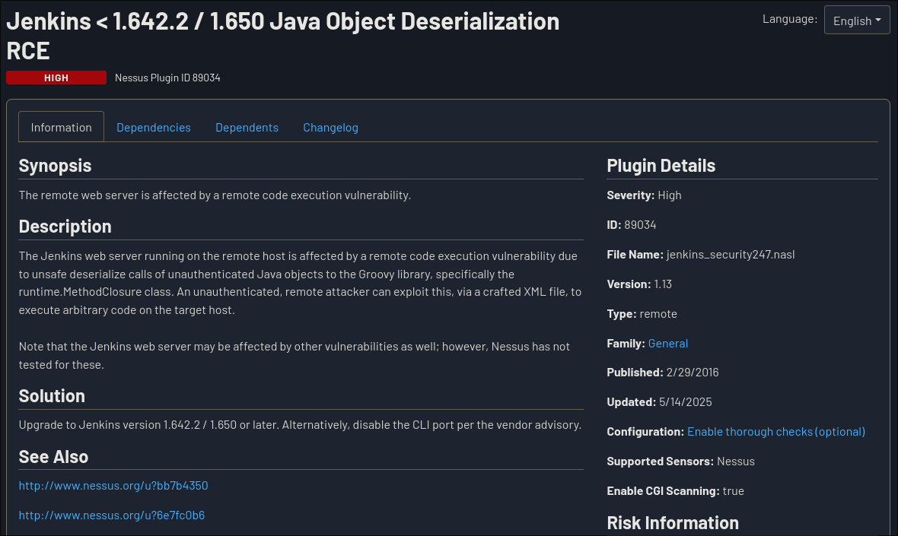

# Performance, Security, and Usability Testing

by Srinesh Nisala (Senior Software Engineer @ iLabs)

- LinkedIn: [https://www.linkedin.com/in/srinesh-nisala/](https://www.linkedin.com/in/srinesh-nisala/)
- GitHub: [https://github.com/s1n7ax](https://github.com/s1n7ax)

---

## Pre-requisites

- Basic understanding of software testing concepts
- Familiarity with web applications and APIs
- Access to a computer with internet connection for tools setup

---

## Module Overview

This module covers three critical aspects of software testing:

1. **Performance Testing** - Load testing with JMeter
2. **Security Testing** - OWASP Top 10 fundamentals
3. **Usability Testing** - Principles and heuristics evaluation

---

## Part 1: Performance Testing with JMeter

Anton Putra has comprehensively covered performance testing in his YouTube series.
[https://www.youtube.com/@AntonPutra](https://www.youtube.com/@AntonPutra)

### What is Performance Testing?

Performance testing evaluates how well a system performs under various conditions:

- **Load Testing**: Normal expected load
- **Stress Testing**: Beyond normal capacity
- **Spike Testing**: Sudden load increases
- **Volume Testing**: Large amounts of data

---

### JMeter Introduction

Apache JMeter is an open-source tool for performance testing:

- Java-based application
- GUI and command-line modes
- Supports various protocols (HTTP, HTTPS, FTP, JDBC, etc.)

---

### Quick JMeter Setup Demo

```bash
# Download and extract JMeter
wget https://archive.apache.org/dist/jmeter/binaries/apache-jmeter-5.6.2.zip
unzip apache-jmeter-5.6.2.zip
cd apache-jmeter-5.6.2/bin
./jmeter.sh
```

---

### JMeter Load Testing Demo

1. **Thread Group**: Simulates users

   - Number of threads (users)
   - Ramp-up period
   - Loop count

2. **HTTP Request Sampler**: Defines the request

   - Server name/IP
   - Port number
   - Method (GET, POST, etc.)
   - Path

3. **Listeners**: View results
   - View Results Tree
   - Summary Report
   - Graph Results

---

## Part 2: Security Testing Fundamentals - OWASP Top 10

### OWASP Top 10 Overview

The Open Web Application Security Project (OWASP) Top 10 represents the most critical security risks:

- [Top 10 Web Application Security Risks](https://owasp.org/www-project-top-ten/)
- [Learn the hack - Stop the attack](https://owasp.org/www-project-webgoat/)

---

#### 1. Broken Access Control

[Facebook Privileged (De)-escalation vulnerability](https://www.youtube.com/watch?v=MeRuhg4B7vE&t=55s)

- **Risk**: Users can access unauthorized functionality
- **Causes**:
  - Missing access control checks
  - Improper role validation
  - Direct object references
  - Elevation of privilege vulnerabilities
- **Example**: Direct URL access to admin pages
- **Testing**: Try accessing restricted URLs without proper authentication

---

#### 2. Cryptographic Failures




- **Risk**: Sensitive data exposure due to weak encryption
- **Causes**:
  - Weak encryption algorithms
  - Poor key management
  - Storing sensitive data in plaintext
  - Using deprecated cryptographic functions
- **Example**: Plain text passwords, weak hashing
- **Testing**: Check for HTTPS usage, password storage methods

---

#### 3. Injection



- **Risk**: Untrusted data sent to interpreter
- **Causes**:
  - Lack of input validation
  - Improper parameterization
  - Insufficient sanitization
  - Dynamic query construction
- **Example**: SQL injection, command injection
- **Testing**: Input validation with malicious payloads

```sql
query = "SELECT * FROM users WHERE username = '" + username + "';"
cursor.execute(query)
```

Passing `' OR '1'='1` as `username` would return all users.

```sql
query = "SELECT * FROM users WHERE username = ?"
cursor.execute(query, (username,))
```

---

#### 4. Insecure Design



- **Risk**: Flawed architecture and design
- **Causes**:
  - Missing security requirements
  - Threat modeling gaps
  - Inadequate security controls
  - Lack of security by design principles
- **Example**: Missing security controls in design phase
- **Testing**: Review system architecture for security gaps

---

#### 5. Security Misconfiguration



- **Risk**: Insecure default configurations
- **Causes**:
  - Default settings left unchanged
  - Incomplete configurations
  - Excessive privileges
  - Missing security hardening
- **Example**: Default passwords, unnecessary services enabled
- **Testing**: Check for default configurations, exposed admin interfaces

---

#### 6. Vulnerable and Outdated Components



- **Risk**: Using components with known vulnerabilities
- **Causes**:
  - Poor dependency management
  - Lack of security updates
  - Using deprecated components
  - Insufficient vulnerability monitoring
- **Example**: Old library versions with security flaws
- **Testing**: Dependency scanning, version checking

---

#### 7. Identification and Authentication Failures



- **Risk**: Compromised user identity functions
- **Causes**:
  - Weak password policies
  - Insufficient session management
  - Poor credential storage
  - Missing multi-factor authentication
- **Example**: Weak passwords, session management flaws
- **Testing**: Brute force attacks, session hijacking attempts

---

#### 8. Software and Data Integrity Failures



- **Risk**: Untrusted software updates and data
- **Causes**:
  - Lack of integrity verification
  - Insecure CI/CD pipelines
  - Unsigned code
  - Missing checksum validation
- **Example**: Unsigned software updates
- **Testing**: Verify software signatures, data integrity checks

---

#### 9. Security Logging and Monitoring Failures


- **Risk**: Insufficient logging and monitoring
- **Causes**:
  - Inadequate logging implementation
  - Missing alerting systems
  - Poor incident response
  - Lack of log analysis
- **Example**: No audit logs, delayed breach detection
- **Testing**: Check logging mechanisms, incident response

---

#### 10. Server-Side Request Forgery (SSRF)

- **Risk**: Application fetches remote resources without validation
- **Causes**:
  - Insufficient URL validation
  - Lack of network segmentation
  - Improper input filtering
  - Missing allowlist controls
- **Example**: Internal network access through application
- **Testing**: Manipulate URLs to access internal resources

### Security Testing Tools Demo

Quick demonstration of common security testing tools:

- **OWASP ZAP**: Web application security scanner
- **Burp Suite**: Web vulnerability scanner
- **Browser Developer Tools**: For manual testing

### Manual Security Testing Example

Simple XSS test:

```html
<script>
  alert("XSS");
</script>
```

---

## Part 3: Usability Testing Principles and Heuristics

### What is Usability Testing?

Usability testing evaluates how easy and intuitive a product is to use:

- **User Experience (UX)**: Overall user satisfaction
- **User Interface (UI)**: Visual and interactive elements
- **Accessibility**: Usability for users with disabilities

### Nielsen's 10 Usability Heuristics

#### 1. Visibility of System Status

- Keep users informed about what's happening
- **Example**: Loading indicators, progress bars

#### 2. Match Between System and Real World

- Use familiar language and concepts
- **Example**: Shopping cart metaphor in e-commerce

---

#### 3. User Control and Freedom

- Provide undo/redo functionality
- **Example**: Back button, cancel operations

---

#### 4. Consistency and Standards

- Follow platform conventions
- **Example**: Consistent navigation, standard icons

---

#### 5. Error Prevention

- Prevent errors through good design
- **Example**: Form validation, confirmation dialogs

---

#### 6. Recognition Rather Than Recall

- Make information visible
- **Example**: Recently used items, visible options

---

#### 7. Flexibility and Efficiency of Use

- Shortcuts for experienced users
- **Example**: Keyboard shortcuts, customizable interfaces

---

#### 8. Aesthetic and Minimalist Design

- Remove unnecessary elements
- **Example**: Clean interfaces, focused content

---

#### 9. Help Users Recognize, Diagnose, and Recover from Errors

- Clear error messages with solutions
- **Example**: Specific error descriptions, recovery suggestions

---

#### 10. Help and Documentation

- Easy to find and follow help
- **Example**: Search functionality, step-by-step guides

### Usability Testing Methods

1. **Moderated Testing**: Researcher guides users
2. **Unmoderated Testing**: Users complete tasks independently
3. **A/B Testing**: Compare different versions
4. **Heuristic Evaluation**: Expert review using heuristics
5. **Card Sorting**: Information architecture testing

---

## Practical Exercise Ideas (For Self-Study)

### Performance Testing

- Set up JMeter and create a test plan for a public API
- Monitor system resources during load testing
- Analyze bottlenecks and performance issues

### Security Testing

- Use OWASP ZAP to scan a test application
- Practice manual testing for common vulnerabilities
- Review application logs for security events

### Usability Testing

- Conduct heuristic evaluation on a website
- Create user personas and scenarios
- Design usability test protocols

---

## Tools and Resources

### Performance Testing

- **JMeter**: [https://jmeter.apache.org/](https://jmeter.apache.org/)
- **LoadRunner**: Commercial tool
- **Gatling**: Modern load testing tool

### Security Testing

- **OWASP ZAP**: [https://www.zaproxy.org/](https://www.zaproxy.org/)
- **Burp Suite**: [https://portswigger.net/burp](https://portswigger.net/burp)
- **OWASP WebGoat**: Practice application

### Usability Testing

- **UsabilityHub**: Online usability testing
- **Hotjar**: User behavior analytics
- **Figma**: Design and prototyping tool

---

## Key Takeaways

1. **Performance Testing**: Essential for ensuring applications can handle expected load
2. **Security Testing**: Critical for protecting user data and system integrity
3. **Usability Testing**: Improves user satisfaction and adoption
4. **Integration**: These testing types complement each other in comprehensive QA strategy
5. **Continuous Testing**: Implement these tests throughout the development lifecycle

---

## Further Reading

- [OWASP Testing Guide](https://owasp.org/www-project-web-security-testing-guide/)
- [JMeter User Manual](https://jmeter.apache.org/usermanual/)
- [Nielsen Norman Group - Usability Heuristics](https://www.nngroup.com/articles/ten-usability-heuristics/)
- [Web Content Accessibility Guidelines (WCAG)](https://www.w3.org/WAI/WCAG21/quickref/)
