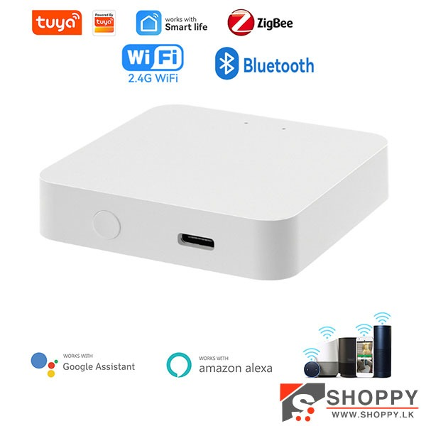
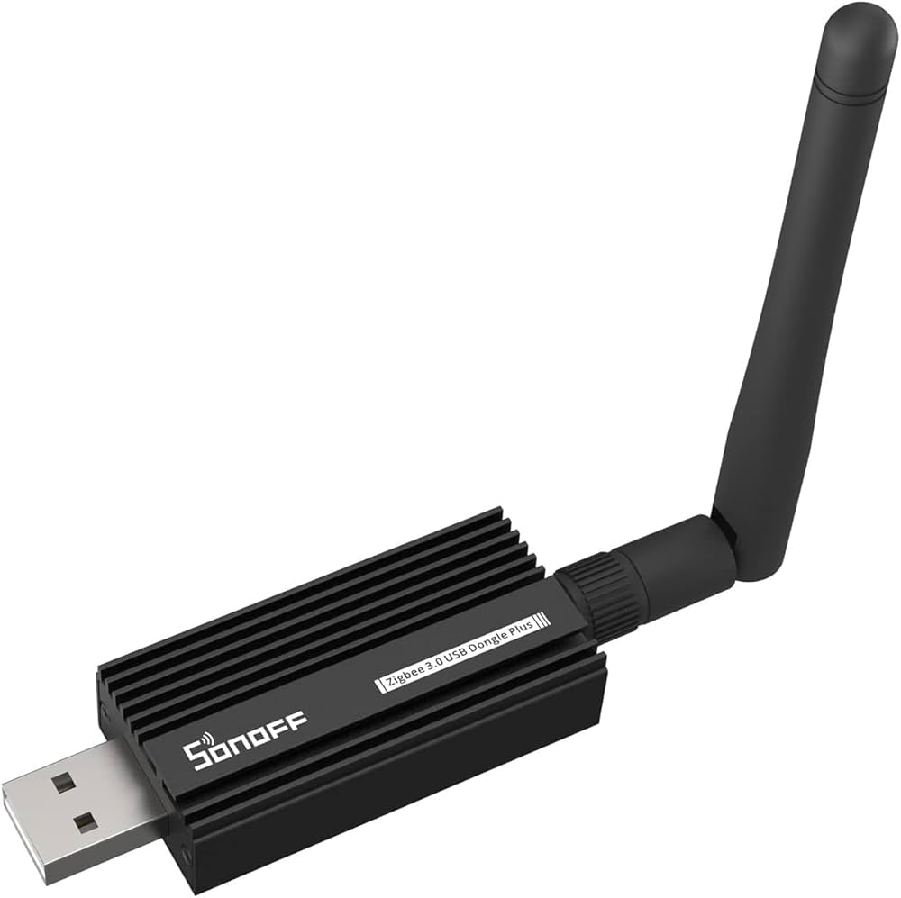
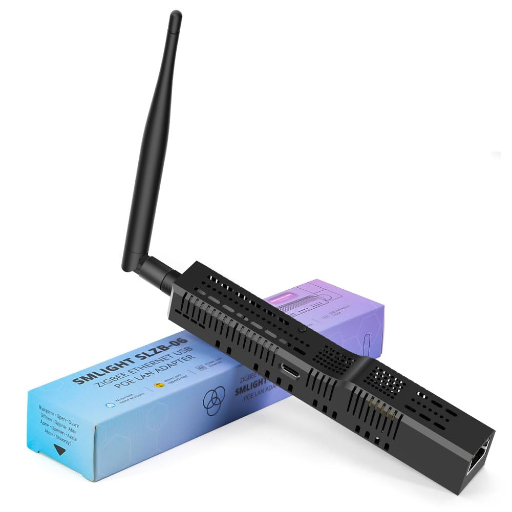

# Smart Home

---

## Cheapest way to get started

### Prerequisites

> [!NOTE] WiFi network should be 2.4GHz not 5GHz

- Buy WiFi device
- Install the (what ever they say we should use) app on mobile
- Follow the instructions in manual to connect the device

> [!WARNING]
> I don't use these apps nor trust them

---

### Where to buy devices

- [Daraz](https://www.daraz.lk)
- [Temu](https://www.temu.com/)
- [Ali express](https://www.aliexpress.com/)

---

### How to find devices

- Search by brand
  - Tuya (cheap)
  - Moes (mid)
  - Sonoff (mid/expensive)
  - Aqara (expensive)

- Search by device type
  - WiFi/Smart bulb
  - WiFi/Smart switch
  - WiFi/Smart plug

> [!WARN] Tuya
>
> - LED Bulbs get pretty hot, and some of them stopped working after few months
> - Plug stops working completely or relay stops working after few months

> [!WARN] Moes
>
> - They lie sometimes - Human presence sensor is not a presence sensor

---

## WiFi vs Zigbee

For a smart-home network, both Wi-Fi and Zigbee work well—but they shine in very different roles

---

### WiFi Devices

**Pros:**

- Works with existing WiFi infrastructure
- Generally devices are cheaper
- Better bandwidth (for video/audio)

**Cons:**

- Can congest your WiFi network with many devices
- Higher power consumption (not ideal for battery-powered devices)

---

### Zigbee Devices

**Pros:**

- Better range through mesh topology
- Low power consumption (great for battery devices)
- Less WiFi network congestion
- Can support hundreds of devices

**Cons:**

- Requires a Zigbee hub/coordinator

---

### Recommendation

Use both

> [!NOTE]
>
> - Zigbee also uses 2.4 GHz so to reduce interference by selecting channels that are not used by WiFi

---

## Zigbee Coordinator

A Zigbee coordinator is a device that acts as a hub for your Zigbee network.

### Types of Zigbee Coordinators

> [!NOTE]
>
> - There are different versions of Zigbee coordinators. Buy the 3.0 version (latest)

- Which coordinator to buy?
  - No PC?
    - Tuya ZigBee 3.0 Multimode Gateway
  - Got PC?
    - SONOFF ZBDongle
    - SLZB-06 ([Check this issue](https://github.com/Koenkk/zigbee2mqtt/issues/17809))

---

#### Tuya ZigBee 3.0 Multimode Gateway

---

#### SONOFF ZBDongle

---

#### SLZB-06

---
