# Intro to Smart Home

---

## ☁️ Easiest start: WiFi devices that depend on the vendor cloud

### Prerequisites

> [!NOTE]
> This approach needs:
>
> - A 2.4GHz WiFi network, not 5GHz
> - A working internet connection 🌐
> - The vendor app and cloud service to stay online

- Buy a WiFi device
- Install the app they tell you to use on your phone
- Follow the manual to connect the device

> [!WARNING]
> I neither use nor trust this setup
>
> - Your device talks to some remote server just to switch on a bulb a couple of meters away
> - If your internet is down, setup may fail and the device may stop responding properly
> - If the vendor app, cloud, or region has issues, your devices can become slow, unreliable, or unusable
> - The vendor can shut down the app or cloud whenever they want, turning your hardware into e-waste
> - It's acceptable as a starting point. Just don't build your entire house around it

---

### Where to buy devices

- [Daraz](https://www.daraz.lk)
- [Temu](https://www.temu.com/)
- [Ali express](https://www.aliexpress.com/)

---

### How to find devices

- Search by brand
  - Tuya (cheap)
  - Moes (mid)
  - Sonoff (mid/expensive)
  - Aqara (expensive)

- Search by device type
  - WiFi/Smart bulb
  - WiFi/Smart switch
  - WiFi/Smart plug

### Brands - lessons learned the hard way

> [!WARNING] Tuya
>
> - LED bulbs run quite hot, and some failed after only a few months
> - Plugs either die completely or the relay fails after a few months
> - "Tuya" is not really a brand - it's a platform. You get the same white-label hardware sold under dozens of names

> [!WARNING] Moes
>
> - Their labeling is sometimes misleading - a human presence sensor is not always actually a presence sensor

---

## WiFi vs Zigbee

For a smart-home setup, both Wi-Fi and Zigbee are useful - but they are good at different things.

|                 | WiFi                | Zigbee                               |
| --------------- | ------------------- | ------------------------------------ |
| Extra hardware  | None                | Coordinator required                 |
| Power draw      | High                | Very low                             |
| Battery devices | Not a good fit      | Designed for them                    |
| Range           | Limited to router   | Mesh - every mains device extends it |
| Device count    | Routers struggle    | Hundreds                             |
| Bandwidth       | High (camera/audio) | Tiny (on/off, sensor values)         |

### Recommendation

Use both.

- **Zigbee** - battery-powered devices (sensors, buttons, door contacts) and wall switches
- **WiFi** - speakers and other devices that move real data
- **Network cable / PoE** - cameras, whenever possible

> [!NOTE]
>
> - Zigbee also operates on 2.4 GHz, so reduce interference by choosing channels that do not overlap with WiFi
> - If WiFi uses 1 / 6 / 11, choose Zigbee 15, 20, 25, or 26
> - Every **mains-powered** Zigbee device acts as a router and strengthens the mesh. Battery devices do not repeat

> [!TIP]
> Before buying anything, search the model name on
> [Zigbee2MQTT supported devices](https://www.zigbee2mqtt.io/supported-devices/) and
> [Blakadder](https://zigbee.blakadder.com/). If it is missing from both, you're probably on your own

---

## Zigbee Coordinator

A Zigbee coordinator is the hub device for your Zigbee network.

### Types of Zigbee Coordinators

> [!NOTE]
>
> - Zigbee coordinators come in different versions. Buy the 3.0 version, which is the latest

- Which coordinator should you buy?
  - No PC?
    - Tuya ZigBee 3.0 Multimode Gateway - cheapest option, but cloud-based and internet-dependent 🌐
  - Have a PC?
    - **SONOFF Dongle-M (dual antenna)** - this is the one I recommend
    - Other simple USB Zigbee 3.0 dongles are also worth considering before jumping to an SLZB-06
    - SLZB-06 - Ethernet/PoE, only worth it if your server is in a terrible location for radio. It did not work for me - see below

> [!WARNING]
> Keep the coordinator away from USB 3.0 ports, SSDs, and the PC case. USB 3 noise wrecks 2.4GHz.
> Use a USB extension cable - that solves most "Zigbee is unstable" complaints

---

#### ☁️ Tuya ZigBee 3.0 Multimode Gateway (vendor cloud required)

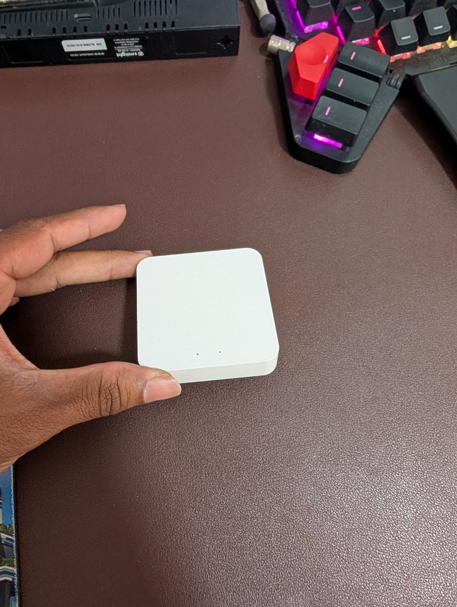

- Cheapest way to get started, no PC required
- But it is a **cloud** gateway - so you're back to the vendor app
- Needs internet and the vendor service to stay up 🌐
- If the internet or vendor cloud has issues, pairing, control, and automations may break
- Buy this only if you do not plan to run Home Assistant

---

#### ☁️ Tuya cloud gateway - ports and pairing button

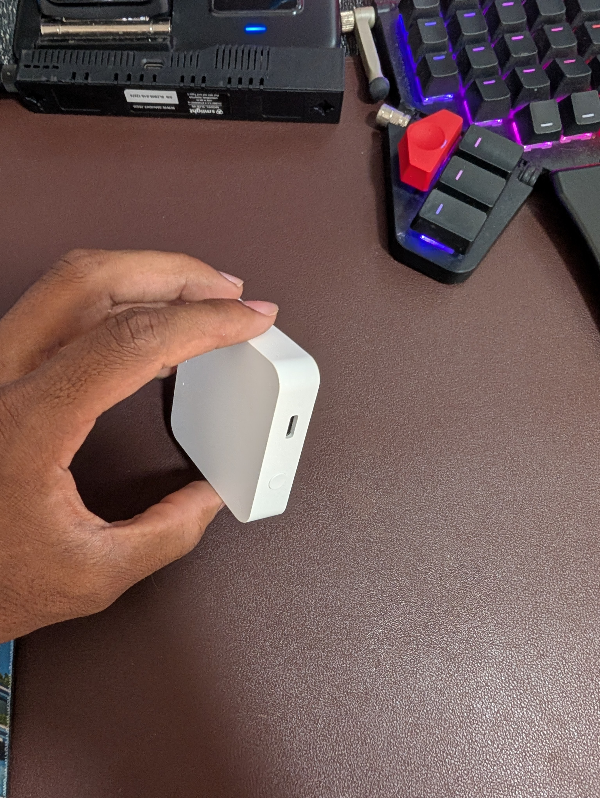

---

#### ☁️ Tuya cloud gateway - product shot

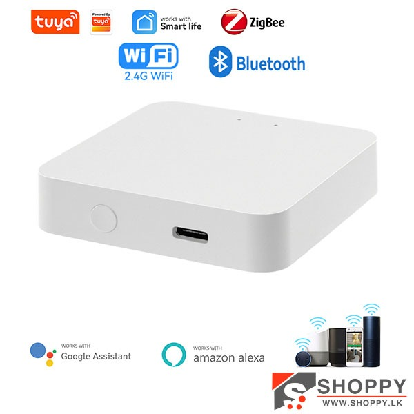

---

#### SONOFF USB dongles

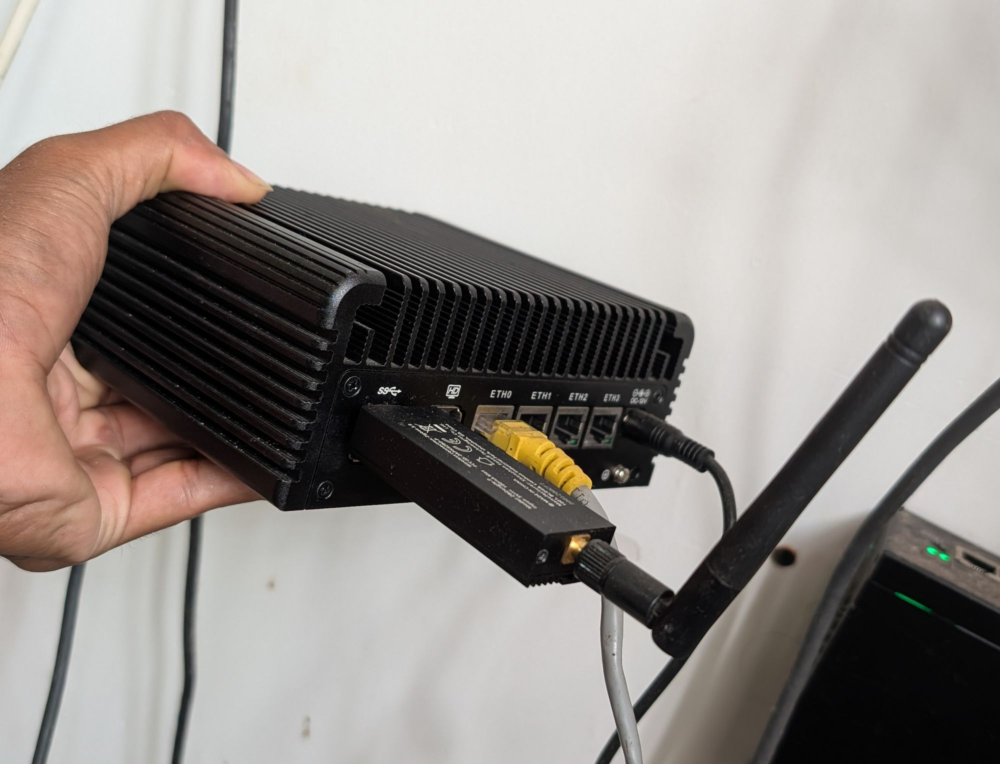

- **ZBDongle-P** (TI CC2652P) - the safe, boring, well-supported option
- **ZBDongle-E** (Silabs EFR32MG21) - newer, but early firmware support was rough
- Plugs into the PC or server running the software

---

#### SONOFF USB dongles - product shot

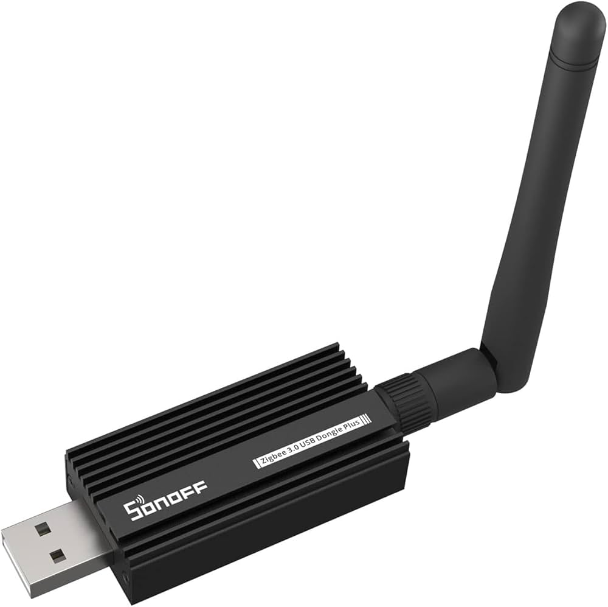

---

### SONOFF Dongle-M (Recommend)

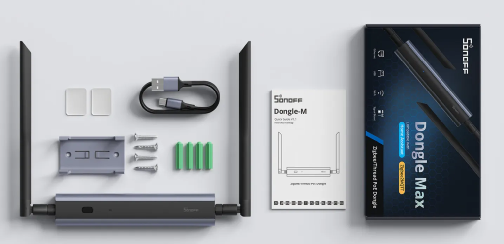

---

#### SLZB-06

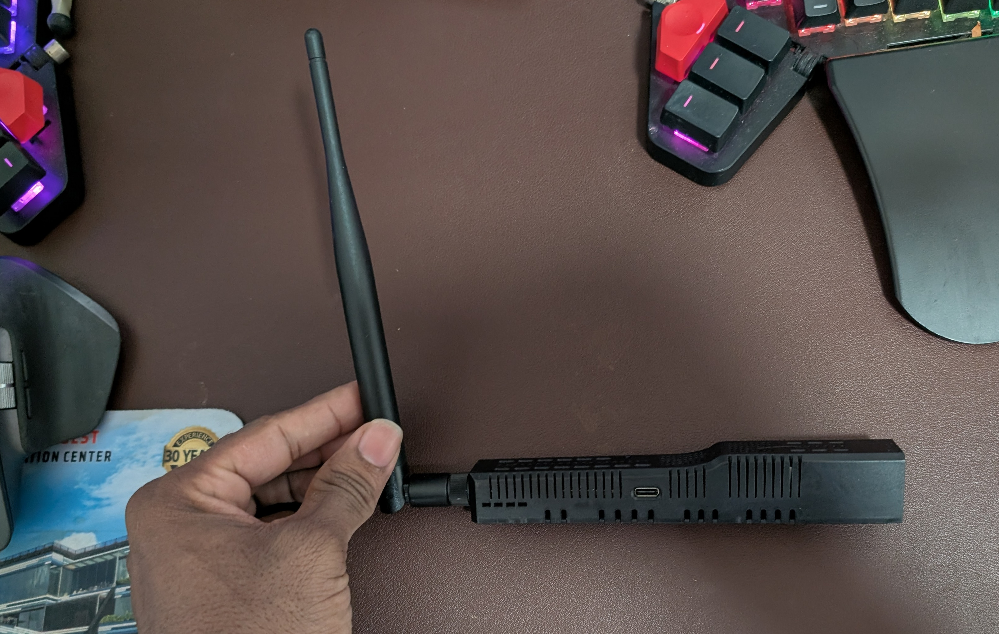

- Ethernet / PoE / WiFi / USB - place it in the middle of the house instead of next to the server
- On paper, it has the best placement options of the three

> [!WARNING]
> This did not work for me - devices kept falling off the network
> ([this issue](https://github.com/Koenkk/zigbee2mqtt/issues/17809)). I switched to the SONOFF Dongle-M

---

#### SLZB-06 - product shot

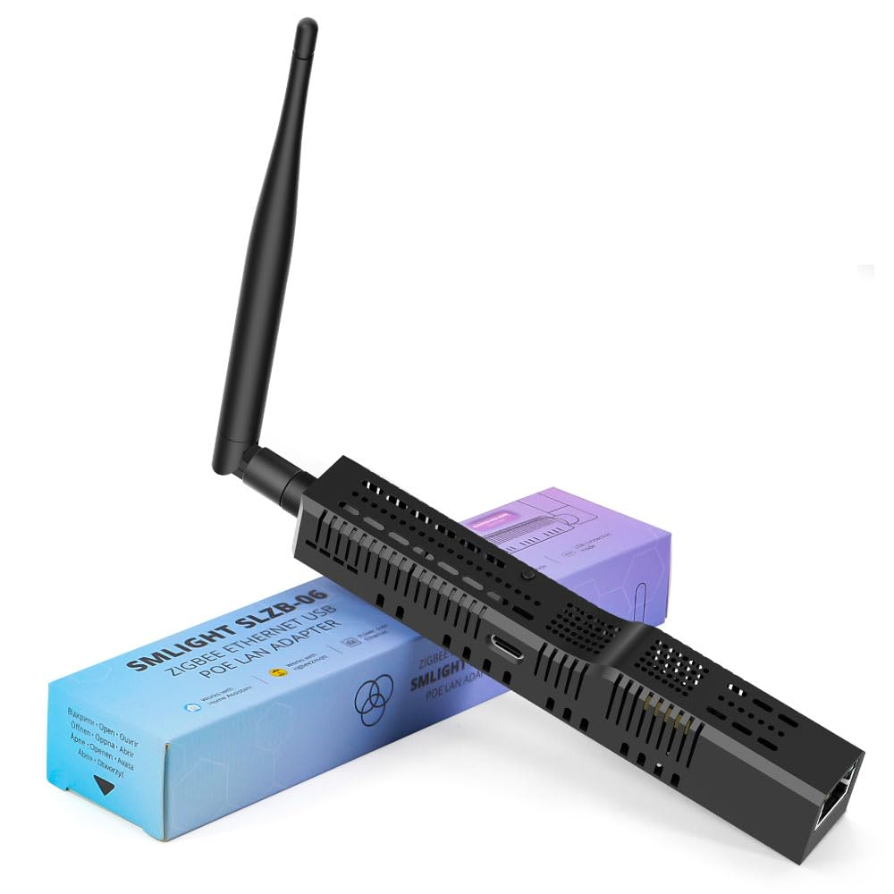

---

## The brain

A coordinator is only a radio. Something still has to run the logic.

- [Home Assistant](https://www.home-assistant.io/) - what I use. It runs on a mini PC, an old laptop, or a Pi
- Zigbee integration options:
  - **Zigbee2MQTT** - broadest device support, more control
  - **ZHA** - built into Home Assistant, less setup

> [!NOTE]
> Choose one. Running both on the same dongle is not a real option

### Home Assistant OS vs container setup

You have two normal ways to run Home Assistant:

- **Home Assistant OS** - easiest path. Flash it to a dedicated box and you get the full appliance-style experience, including add-ons and backups from the UI
- **Docker / Podman / Quadlet** - more flexible if you already have a Linux server and want Home Assistant to live next to the rest of your services

#### My actual configs

I do not run Home Assistant OS. I run the container approach on my Linux server.

If you want to copy my setup, use the actual configs from GitHub:

- [Home Assistant](https://github.com/s1n7ax/nixos/blob/4604e51b0e134a7f3cb1a359f8ad80ce44030cd4/system/home-manager/self-hosted-services/home-assistant.nix)
- [Mosquitto / MQTT](https://github.com/s1n7ax/nixos/blob/4604e51b0e134a7f3cb1a359f8ad80ce44030cd4/system/home-manager/self-hosted-services/mqtt.nix)
- [Zigbee2MQTT](https://github.com/s1n7ax/nixos/blob/4604e51b0e134a7f3cb1a359f8ad80ce44030cd4/system/home-manager/self-hosted-services/z2m.nix)
- [Node-RED](https://github.com/s1n7ax/nixos/blob/4604e51b0e134a7f3cb1a359f8ad80ce44030cd4/system/home-manager/self-hosted-services/node-red.nix)

---

### My Home Assistant dashboard

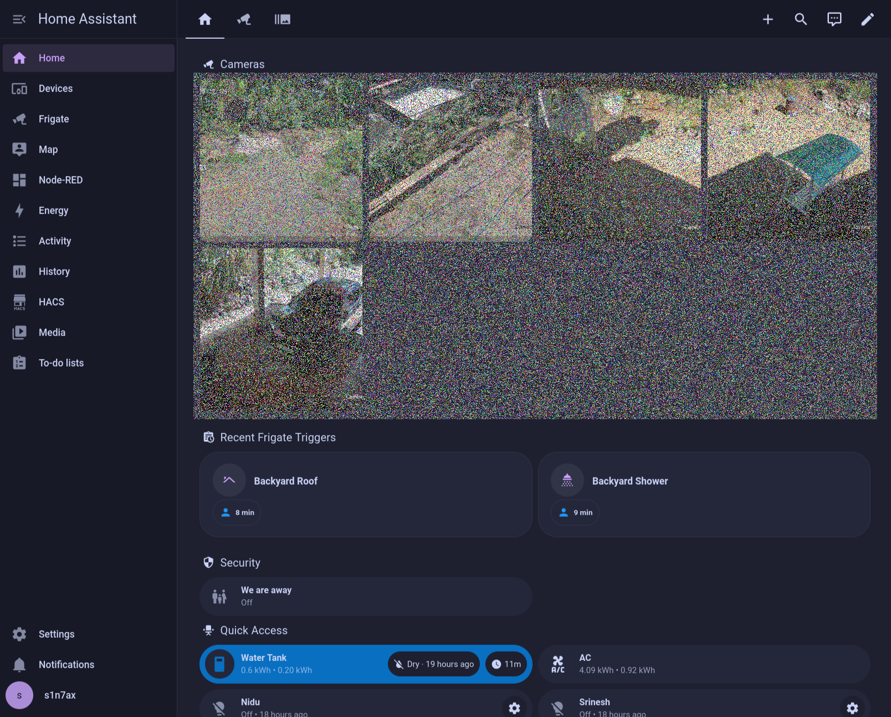

- Cameras, lights, AC, and the water tank - all in one place, with no vendor apps
- Works the same on your phone as it does in the browser

---

### My Home Assistant dashboard

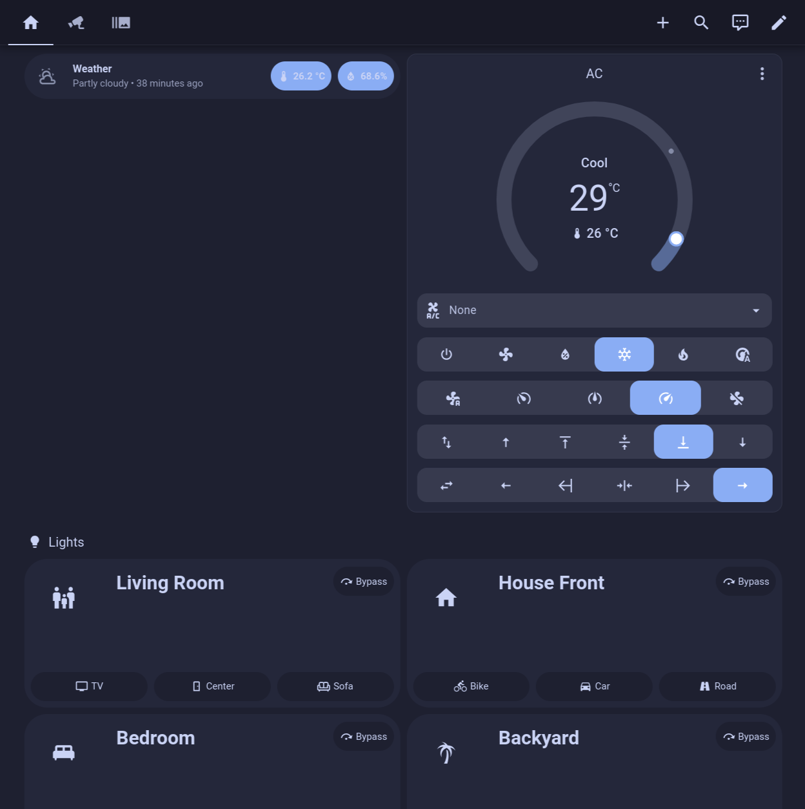

---

### Node-RED

[Node-RED](https://nodered.org/) - drag-and-drop automation. Install it as a Home Assistant add-on.

- Home Assistant automations are fine for simple "if this then that" logic
- Node-RED is for the ugly stuff - loops, delays, retries, and visible branching
- You can run both at the same time. Same devices, different editor

> [!NOTE]
> It is not required. Start with Home Assistant automations and move only the messy ones to Node-RED

---

#### Home Assistant automation

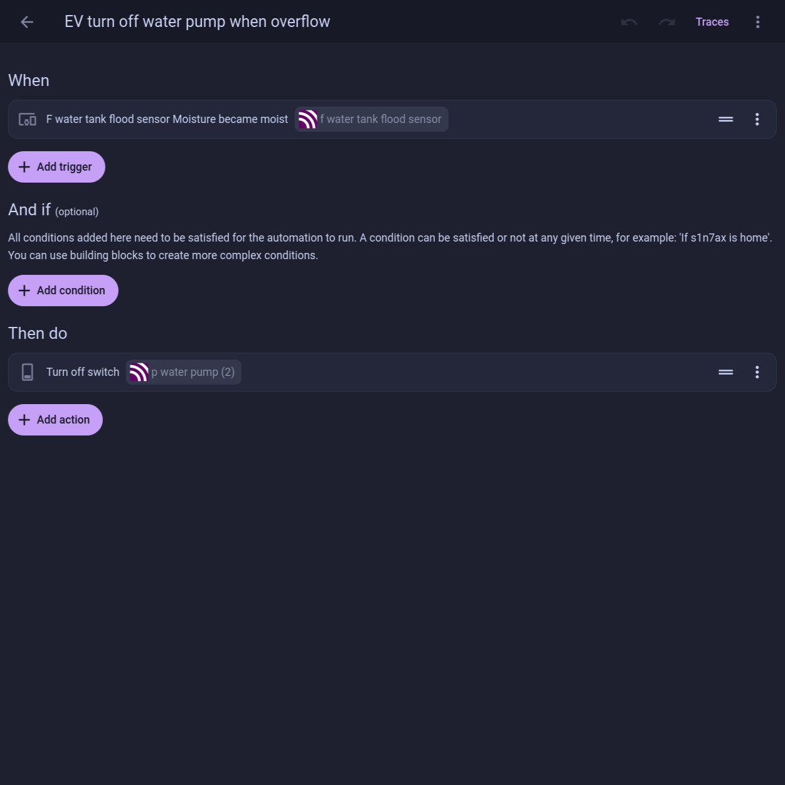

- When / And if / Then do - one trigger, one action, done in a minute
- Great for things like "flood sensor is wet -> shut off the pump"

---

#### Node-RED flow

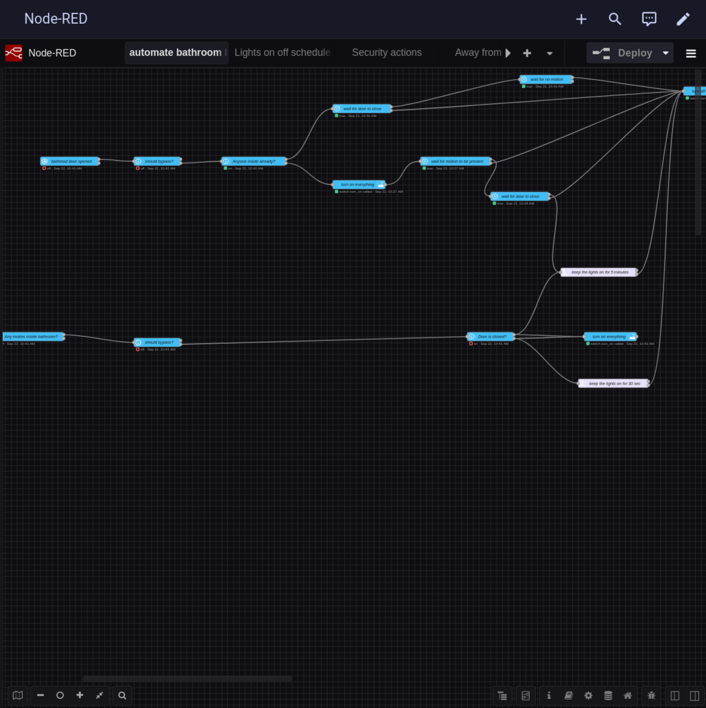

- Same basic idea, but you can see the full flow - waits, branches, timers
- This one is just for "bathroom lights": door opened, is anyone inside, wait for motion, wait for
  the door to close, keep the lights on for 5 minutes
- Try writing that as one Home Assistant automation and you will understand why Node-RED exists

---

## Devices to buy

### Door / window contact sensor

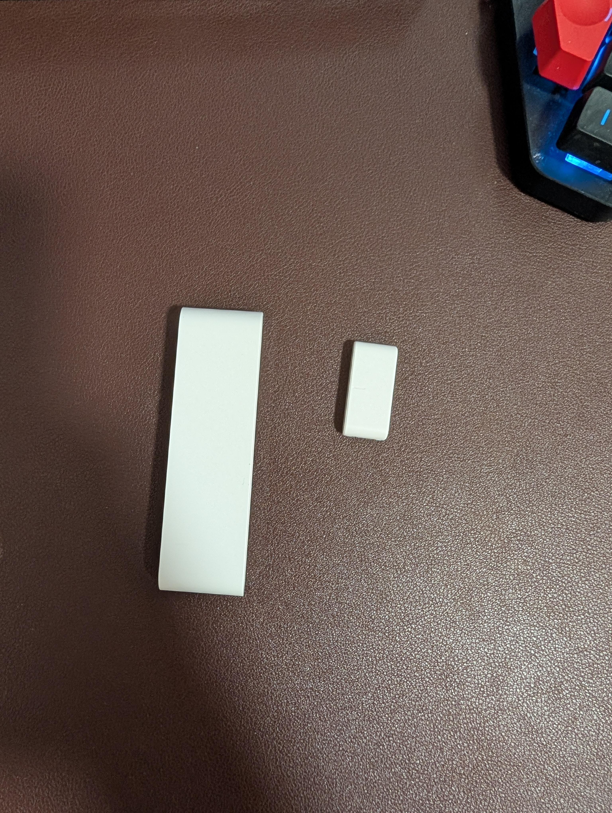

- Two pieces - the body on the frame, the magnet on the door. It only reports open or closed
- Battery powered, so Zigbee makes sense. Usually lasts a year or longer
- The first automation most people build - door opens, light turns on

---

### Motion sensor (SONOFF PIR)

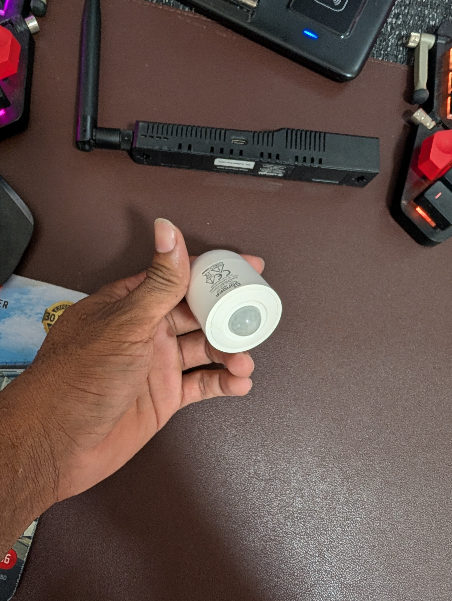

- PIR means it detects **movement**, not presence. Sit still and it assumes the room is empty
- Magnetic base, easy to stick in a corner
- Pair it with a door sensor so the lights stay on while you are actually using the room

> [!WARNING]
> If you need "someone is in the room but not moving," you need an mmWave presence sensor,
> not a PIR. And Moes is not always honest about which one they are selling

---

### Smart plug (Zigbee 3.0)

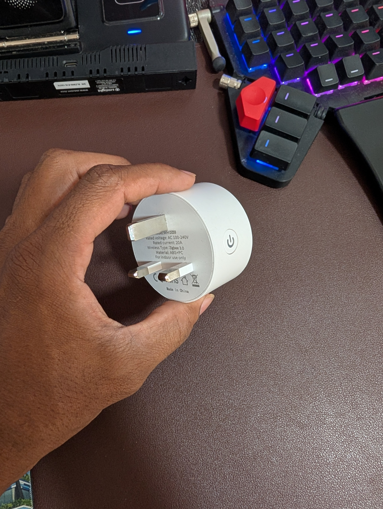

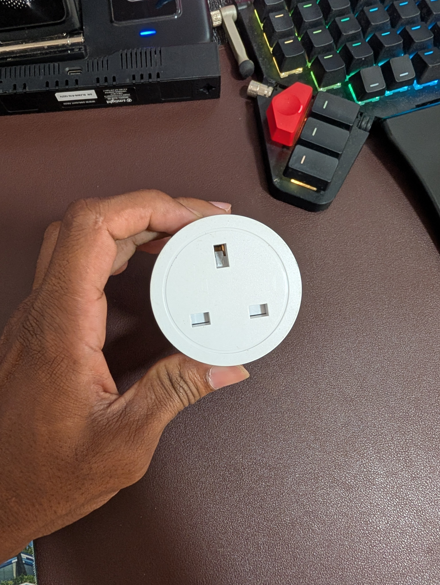

- Easiest upgrade - plug it in, no wiring, nothing to turn off at the breaker
- Most of them report power usage, so you can see what your fridge or pump actually costs
- **Mains powered = Zigbee router**. Buy 2-3 early and your mesh improves automatically
- Check the rated current before using one with a water pump or heater (this one is 20A)

---

### In-wall relay module (SONOFF MINI)

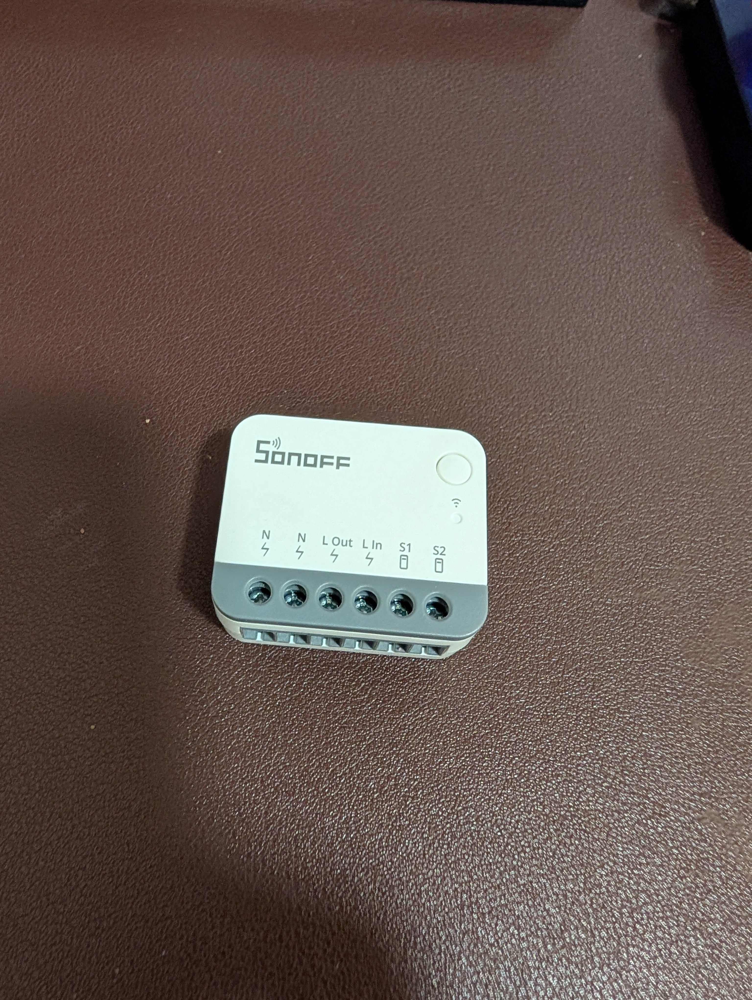

- Fits **behind** the existing wall switch, inside the back box
- The physical switch still works (S1/S2), and Home Assistant can control it too
- Best choice when you want the room to look normal but still be automated
- Requires neutral (N) in the switch box - many older houses do not have it

> [!WARNING]
> Mains voltage. If you are not comfortable working inside a switch box, hire an electrician

---

### Smoke detector (Aqara)

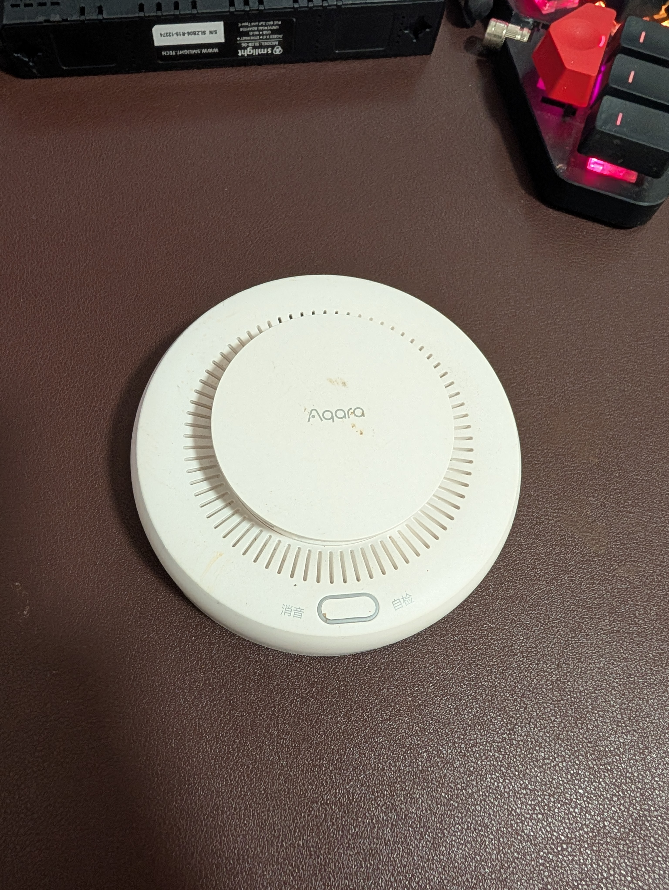

- Sounds the alarm locally **and** sends a notification to your phone
- This is where local control really matters - it must still work when the internet is down
- Test button on the front; replace it when the firmware reports end of life

---

## My suggested starting kit

1. Zigbee coordinator (SONOFF Dongle-M, dual antenna)
2. Home Assistant on anything with 4GB RAM
3. 2-3 Zigbee smart plugs - they also act as mesh routers
4. 1 motion sensor + 1 door sensor
5. Build one automation you will actually use, then expand from there
